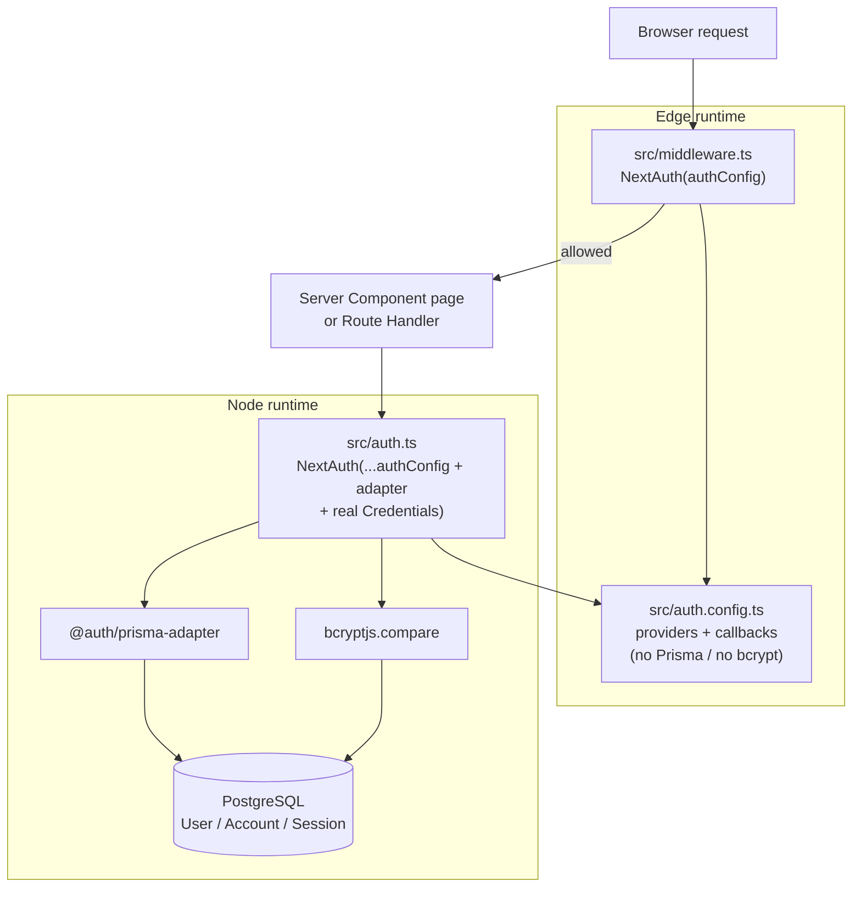
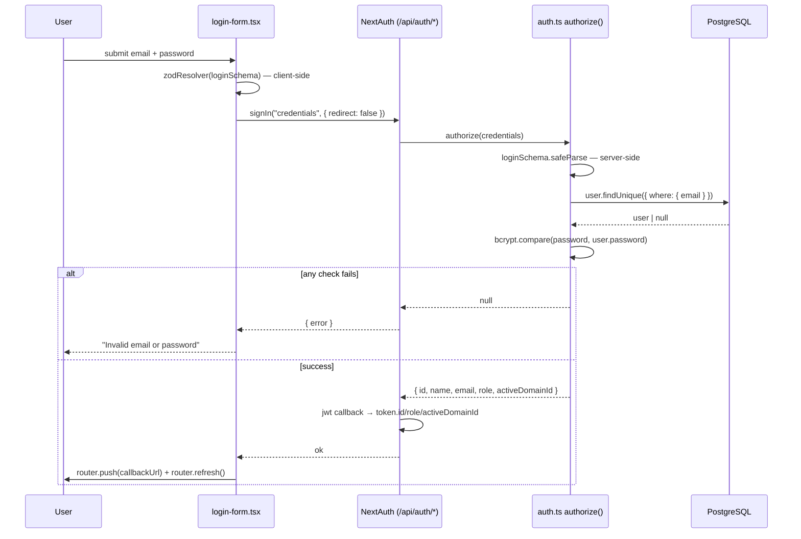
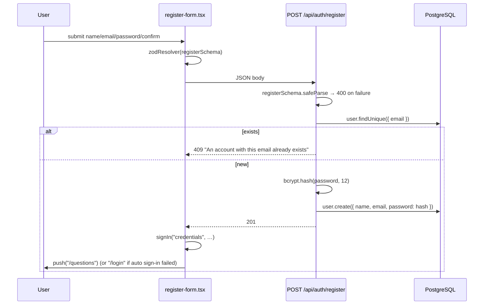
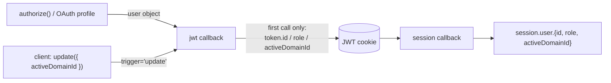

# Authentication — Design (as built)

> Describes the current implementation, including its rough edges. Problems are collected
> separately under [Observed Technical Debt](#observed-technical-debt).

## High-level architecture

NextAuth v5 (beta) with a **split configuration**:

- `src/auth.config.ts` — Edge-safe. No Prisma, no bcrypt. Declares providers (Google + a *stub*
  Credentials provider), the custom sign-in page, and the `jwt` / `session` callbacks. This is the
  object `src/middleware.ts` instantiates, because Next.js middleware runs on the Edge runtime where
  Prisma and bcrypt cannot load.
- `src/auth.ts` — Node runtime. Spreads `authConfig`, adds the `PrismaAdapter`, forces
  `session.strategy = "jwt"`, and replaces the stub Credentials provider with the real one that hits
  the database and bcrypt.

The Edge/Node split is the single most important structural decision here: the middleware can read
and verify a JWT (and therefore knows `isLoggedIn`, `role`, `activeDomainId`) without ever touching
the database.



## Main entry points

| Entry point | File | Purpose |
|---|---|---|
| NextAuth handlers | `src/app/api/auth/[...nextauth]/route.ts` | Re-exports `handlers` as `GET` / `POST` |
| Registration API | `src/app/api/auth/register/route.ts` | `POST` — create a credentials account |
| Login page | `src/app/(auth)/login/page.tsx` → `src/components/auth/login-form.tsx` | |
| Register page | `src/app/(auth)/register/page.tsx` → `src/components/auth/register-form.tsx` | |
| Route guard | `src/middleware.ts` | Global redirect rules |
| Admin guard | `src/app/(main)/admin/layout.tsx` | Role check for `/admin/*` |
| Server-side session | `auth()` exported from `src/auth.ts` | Used by every page and API route |
| Client-side session | `useSession()` from `next-auth/react` | Header, user menu, profile, domain select |

## Relevant files and directories

```
src/
  auth.ts                              NextAuth instance (Node): adapter + real Credentials
  auth.config.ts                       Edge-safe config: providers, pages, jwt/session callbacks
  middleware.ts                        Route protection + domain gate
  types/next-auth.d.ts                 Module augmentation: User / Session / JWT extra fields
  lib/
    validations/auth.ts                loginSchema, registerSchema (Zod v4)
    prisma.ts                          Singleton PrismaClient over pg Pool + PrismaPg adapter
  components/
    auth/login-form.tsx                react-hook-form + zodResolver + signIn("credentials")
    auth/register-form.tsx             react-hook-form + POST /api/auth/register + auto sign-in
    auth/social-buttons.tsx            signIn("google", { callbackUrl: "/questions" })
    auth/user-menu.tsx                 Avatar dropdown; conditional Admin link; signOut
    providers/session-provider.tsx     Wraps the app in NextAuth SessionProvider
  app/
    (auth)/layout.tsx                  Centered card layout for login/register
    (auth)/login/page.tsx
    (auth)/register/page.tsx
    (main)/admin/layout.tsx            ADMIN-only gate
    api/auth/[...nextauth]/route.ts
    api/auth/register/route.ts
    layout.tsx                         SessionProvider + ThemeProvider + Toaster
prisma/
  schema.prisma                        User, Account, Session, VerificationToken, Role
  seed.ts                              Upserts the single ADMIN account
```

## Important types / interfaces

`src/types/next-auth.d.ts` augments NextAuth's types so the extra claims are typed end-to-end:

```ts
declare module "next-auth" {
  interface User    { role?: Role; activeDomainId?: string | null }
  interface Session {
    user: {
      id: string;
      role: Role;
      activeDomainId: string | null;
      name?: string | null; email?: string | null; image?: string | null;
    }
  }
}
declare module "next-auth/jwt" {
  interface JWT { id: string; role: Role; activeDomainId: string | null }
}
```

`Role` is imported from `@/generated/prisma/enums` — the custom Prisma client output path.

Validation types come from `src/lib/validations/auth.ts`:

```ts
export type LoginInput    = z.infer<typeof loginSchema>;     // { email, password }
export type RegisterInput = z.infer<typeof registerSchema>;  // { name, email, password, confirmPassword }
```

## Data flow

### Credentials sign-in



The two-stage validation is deliberate: `loginSchema.safeParse(credentials)` runs *again* inside
`authorize`, because `authorize` can be reached by any client, not just this form.

### Registration



### Token and session shape



The `jwt` callback populates claims **only when `user` is truthy**, i.e. on initial sign-in. The one
mutation path afterwards is:

```ts
if (trigger === "update" && session?.activeDomainId !== undefined) {
  token.activeDomainId = session.activeDomainId;
}
```

Nothing else in the token is refreshed for the life of the session.

## State management

- **Server components** call `await auth()` directly. There is no session context on the server.
- **Client components** use `useSession()`, backed by `SessionProvider` mounted in `src/app/layout.tsx`.
- **Session mutation from the client** uses the `update` function returned by `useSession()`. Two
  callers exist: `src/app/domain-select/page.tsx` and `src/app/(main)/profile/page.tsx`.
- There is no Redux/Zustand/Context store for auth. SWR is used for data fetching but not for session.

## Route protection logic

`src/middleware.ts`, in evaluation order:

```ts
const publicRoutes = ["/", "/login", "/register"];

if (isApiAuthRoute) return;                              // /api/auth/* — always allowed

if (isAuthRoute && isLoggedIn)                           // /login, /register while signed in
  → redirect /questions

if (!isPublicRoute && !isLoggedIn)                       // anything else while signed out
  → redirect /login?callbackUrl=<pathname>

if (isLoggedIn && !activeDomainId
    && !isDomainSelect && !isApiRoute && !isPublicRoute) // signed in, no domain chosen
  → redirect /domain-select
```

Matcher: `["/((?!_next/static|_next/image|favicon.ico|images/).*)"]` — everything except static
assets. Note this **includes `/api/*`**; see Technical Debt.

Layered on top:

| Layer | Mechanism |
|---|---|
| Middleware | Redirects, based on the JWT only |
| `(main)` pages | `const session = await auth(); if (!session?.user) redirect("/login")` |
| `(main)/admin/layout.tsx` | `if (!session?.user \|\| session.user.role !== "ADMIN") redirect("/questions")` |
| API route handlers | `if (!session?.user) return 401` |
| Resource ownership | Per-route checks such as `question.createdBy === session.user.id \|\| (question.isDefault && role === "ADMIN")` |

## Persistence

| Model | Used? | Notes |
|---|---|---|
| `User` | Yes | `password` nullable (OAuth-only accounts), `role`, `shareSlug`, `activeDomainId` |
| `Account` | Yes | Written by the Prisma adapter for Google sign-ins |
| `Session` | **Table exists, unused** | JWT strategy means no DB sessions are created |
| `VerificationToken` | **Table exists, unused** | No email verification or magic-link flow |

`src/lib/prisma.ts` builds a singleton `PrismaClient` over a `pg` `Pool` via `PrismaPg`, cached on
`globalThis` outside production to survive dev hot-reload.

## Error handling

- `POST /api/auth/register` wraps its whole body in `try/catch` and collapses any throw into
  `500 { error: "Something went wrong" }`. Validation failures return the **first** Zod issue only.
- `authorize` never throws — every failure path returns `null`, which NextAuth surfaces as a generic
  error. That is why the UI can only ever show "Invalid email or password".
- Forms hold a single `error` string in local `useState` and render it in a red banner. They do not
  use the toast system that the rest of the app uses.
- No error boundary or custom error page is wired for auth failures.

## External dependencies

| Package | Role |
|---|---|
| `next-auth@^5.0.0-beta.31` | Core auth |
| `@auth/prisma-adapter` | Persists users/accounts |
| `bcryptjs` | Password hashing (cost 12) and comparison |
| `zod` (v4, imported as `zod/v4`) | Schemas |
| `react-hook-form` + `@hookform/resolvers` | Form state and validation wiring |

Environment variables consumed: `AUTH_GOOGLE_ID`, `AUTH_GOOGLE_SECRET`, `DATABASE_URL`, plus
`ADMIN_EMAIL` / `ADMIN_PASSWORD` used only by `prisma/seed.ts`.

## Dependencies on other features

- **Domains** — the middleware's domain gate and `session.user.activeDomainId` are the coupling point.
  See `docs/features/domains/`.
- **Questions / overrides / stars / sharing** — every one of these scopes data by `session.user.id`.
- **Admin surfaces** — `/admin/*` and the `isDefault` flags in questions and topics depend on `role`.

## Implementation decisions worth noting

1. **Split Edge/Node config** — required because `bcryptjs` and Prisma cannot run in middleware.
   The cost is that the middleware trusts the JWT and never re-reads the database.
2. **JWT over database sessions** — cheap and stateless, but means role and domain changes do not
   take effect until re-authentication (except for the one `update` path for `activeDomainId`).
3. **Stub Credentials provider in the Edge config** — `auth.ts` removes it by filtering on
   `(p as { id?: string }).id !== "credentials"` before appending the real one.
4. **Generic auth error message** — deliberate; avoids account enumeration on sign-in. Note that
   registration *does* leak existence via the `409`.
5. **Defence in depth** — session checks are repeated at middleware, page, and API layers rather than
   relying on any single one.

---

## Observed Technical Debt

1. **Middleware redirects API calls instead of letting them 401.** The matcher covers `/api/*`, so an
   unauthenticated `fetch("/api/questions")` receives a `302` to `/login` and, for a client
   expecting JSON, a confusing HTML response after the redirect. The handlers' own `401` branches
   are largely unreachable in normal operation.
2. **`GET /api/domains` has no `auth()` check.** It relies entirely on the middleware for protection.
   If the matcher ever changes, the domain list becomes public.
3. **`updateSession({ name })` on the profile page is not handled** by the `jwt` callback, which only
   reacts to `activeDomainId`. The displayed name in the header may not refresh.
4. **Role and domain changes require re-authentication.** There is no token refresh, so a role
   granted in the database is invisible to a live session.
5. **Email is not normalized.** No trim or lowercase before the uniqueness check, so
   `User@x.com` and `user@x.com` can both register.
6. **Registration leaks account existence** via `409`, while sign-in deliberately does not. The two
   endpoints have inconsistent enumeration postures.
7. **No rate limiting or lockout** on `/api/auth/register` or the credentials provider.
8. **Password policy is minimal** — 6 characters, no other requirement, no maximum length (bcrypt
   silently truncates input beyond 72 bytes).
9. **`Session` and `VerificationToken` tables are dead schema.** They exist because of the adapter
   but are never used under the JWT strategy.
10. **Only the first Zod issue is returned** from the register API, so a form submitted with several
    problems reveals them one at a time.
11. **Google environment variables are unguarded.** `Google({ clientId: process.env.AUTH_GOOGLE_ID, … })`
    receives `undefined` when unset, with no startup validation.
12. **The credentials-provider filter is fragile.** `auth.ts` strips the stub by string-matching the
    provider `id`; a NextAuth internal change to that id would silently reintroduce the always-`null`
    stub and break credentials sign-in.
13. **No account-linking policy is expressed.** Behavior when a Google email collides with an existing
    credentials account is left entirely to adapter defaults and is undocumented here.
</content>
