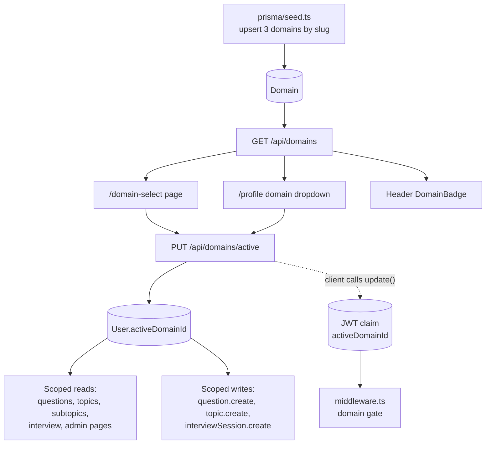
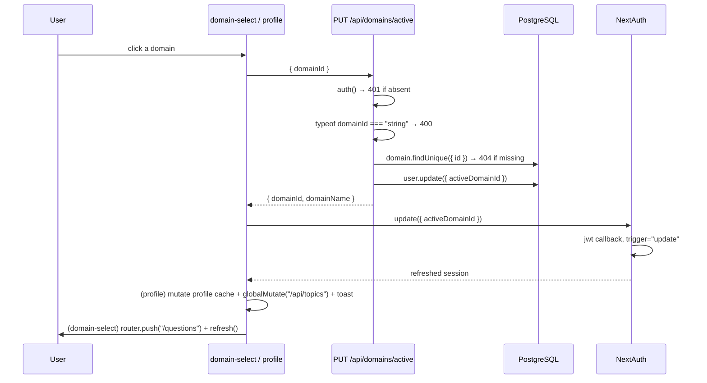

# Domains — Design (as built)

## High-level architecture

Domains are a **scoping dimension**, not a feature with its own screens beyond a picker. The design
has three parts:

1. A `Domain` table populated only by the seed script.
2. A single mutable pointer per user: `User.activeDomainId`, mirrored into the JWT as
   `session.user.activeDomainId`.
3. Scoping applied ad hoc at each read/write site — there is **no shared "current domain" helper**.
   Roughly a dozen call sites independently re-derive the active domain.



## Main entry points

| Entry point | File |
|---|---|
| Domain list API | `src/app/api/domains/route.ts` (`GET`) |
| Set active domain API | `src/app/api/domains/active/route.ts` (`PUT`) |
| First-run picker | `src/app/domain-select/page.tsx` |
| Switcher | `src/app/(main)/profile/page.tsx` ("Interview Domain" card) |
| Header indicator | `src/components/layout/domain-badge.tsx` |
| Redirect gate | `src/middleware.ts` |
| Seed | `prisma/seed.ts` |

## Data model

```prisma
model Domain {
  id        String   @id @default(cuid())
  name      String   @unique
  slug      String   @unique
  createdAt DateTime @default(now())
  updatedAt DateTime @updatedAt

  topics            Topic[]
  questions         Question[]
  users             User[]             @relation("ActiveDomain")
  interviewSessions InterviewSession[]
}

model User {
  activeDomainId String?
  activeDomain   Domain? @relation("ActiveDomain", fields: [activeDomainId], references: [id])
}
```

`Topic.domainId` and `Question.domainId` are both `String?` with `onDelete: SetNull`.
`Question` carries `@@index([domainId])`; `Topic` does not.

Notably, **`SubTopic` has no `domainId`** — it is scoped transitively through `topic.domainId`.

## Data flow

### Setting the active domain



The `update()` call is what keeps the middleware gate from immediately bouncing the user back to
`/domain-select`, because the gate reads the JWT rather than the database.

### How scoping is applied at read time

There are two distinct patterns in the codebase, and they are **not equivalent**:

| Pattern | Where | Behavior when `activeDomainId` is null |
|---|---|---|
| `...(domainId ? { domainId } : {})` | `src/lib/questions.ts`, `resolveRandomQuestionIds`, admin questions page | Filter omitted → **all domains** |
| `where: { domainId: user?.activeDomainId }` | `src/app/api/topics/route.ts`, `src/app/api/subtopics/route.ts` | Filter becomes `domainId IS NULL` → **only domain-less rows** |

Every scoped API route re-fetches the domain itself rather than trusting the session claim:

```ts
const user = await prisma.user.findUnique({
  where: { id: session.user.id },
  select: { activeDomainId: true },
});
```

This appears in `api/questions/route.ts` (GET and POST), `api/questions/export/route.ts`,
`api/topics/route.ts` (GET and POST), `api/subtopics/route.ts`, and
`api/interview/sessions/route.ts` — six independent copies of the same three-line lookup.

The `/questions` **page**, by contrast, uses `session.user.activeDomainId` from the JWT without a
database round-trip. So the page and its own API endpoint can disagree under DOM-X2.

### Domain gate in middleware

```ts
if (isLoggedIn && !req.auth?.user?.activeDomainId
    && !isDomainSelect && !isApiRoute && !isPublicRoute) {
  return Response.redirect(new URL("/domain-select", req.nextUrl));
}
```

`/api/*` is excluded so that `/domain-select`'s own `fetch` calls to `/api/domains` and
`/api/domains/active` are not themselves redirected — which would deadlock the flow.

## Components

### `src/app/domain-select/page.tsx`
Client component. `useSWR<Domain[]>("/api/domains")`, a `selecting` state holding the in-flight
domain id, a three-column card grid, and a skeleton grid of three while loading.
`DOMAIN_ICONS` maps slug → `lucide-react` icon with a book fallback.
Clicks are ignored while `selecting` is truthy (`onClick={() => !selecting && handleSelect(domain)}`).

### `src/app/(main)/profile/page.tsx` — Interview Domain card
Client component using three SWR keys: `/api/profile`, `/api/domains`, plus the NextAuth session.
On change it does an optimistic `mutate` of the profile cache with `false` (no revalidation), then
`globalMutate("/api/topics")` to force the sidebar and topic pickers to refetch.

### `src/components/layout/domain-badge.tsx`
Client component. Resolves the name by finding `session.user.activeDomainId` inside the
`/api/domains` list — it does not read `activeDomain.name` from the profile endpoint. Returns `null`
if the id is not found in the list, so a transient SWR miss hides the badge rather than showing a
placeholder.

## State management

- **Server truth:** `User.activeDomainId`.
- **Session mirror:** the `activeDomainId` JWT claim, updated only via `update()`.
- **Client cache:** SWR keyed on `/api/domains` and `/api/profile`. No global store.
- **Cross-component invalidation:** exactly one call — `globalMutate("/api/topics")` in the profile
  page. Questions are not invalidated (DOM-X6).

## API surface

### `GET /api/domains`
```ts
export async function GET() {
  const domains = await prisma.domain.findMany({
    orderBy: { name: "asc" },
    select: { id: true, name: true, slug: true },
  });
  return NextResponse.json(domains);
}
```
No `auth()` call. Protection comes solely from the middleware redirect described in
`authentication/design.md`.

### `PUT /api/domains/active`
Auth → validate `domainId` is a non-empty string → confirm the domain exists →
`user.update({ activeDomainId })` → return `{ domainId, domainName }`.

## Persistence and caching

- The domain choice is persisted in PostgreSQL and additionally cached in the JWT cookie.
- No HTTP cache headers are set on `/api/domains`; SWR's in-memory cache is the only client caching.
- Domain-scoped question reads are not cached server-side; `getQuestionsForUser` queries on every
  request.

## Error handling

| Site | Behavior |
|---|---|
| `PUT /api/domains/active` | Explicit `401` / `400` / `404` JSON responses |
| `domain-select` | `if (res.ok) { … }` with **no else branch** — silent failure |
| `profile` | `toast.error("Failed to switch domain")` |
| `DomainBadge` | Renders `null` when unresolved — failure is invisible by design |
| SWR errors | Never read; `error` is not destructured at any call site |

## Authentication / authorization

- `PUT /api/domains/active` requires a session; it performs **no** authorization beyond that. Any
  user may activate any domain.
- `GET /api/domains` has no handler-level check at all.
- There is no notion of a domain owner or member.

## Dependencies on other features

| Feature | Coupling |
|---|---|
| Authentication | `activeDomainId` lives in the JWT; the middleware gate is part of the auth pipeline |
| Questions | `domainId` on create; scoped reads in list, detail, export |
| Topics & sub-topics | `domainId` on topic create; scoped topic reads; sub-topics scoped transitively |
| Mock interview | `InterviewSession.domainId`; random selection is domain-scoped |
| Profile sharing | Shared view uses the **owner's** domain, not the viewer's |

## Implementation decisions worth noting

1. **Domains are seed-only.** Treating them as fixed reference data avoids an admin CRUD surface, at
   the cost of requiring a deploy + seed run to add one.
2. **Scoping is duplicated rather than centralized.** Each route re-derives the domain and writes its
   own `where` clause. This is why the two null-handling behaviors (DOM-X1) diverged.
3. **JWT mirror + explicit `update()`** avoids a database read in middleware but introduces the
   staleness window described in DOM-X2.
4. **Content is stamped at creation and never re-stamped**, which makes switching domains cheap and
   non-destructive but means a mis-stamped item can only be fixed in the database.
5. **`SubTopic` deliberately has no `domainId`**, inheriting from its parent topic — fewer columns to
   keep in sync, but it makes `PUT /api/subtopics/[id]` a silent domain-moving operation (DOM-X4).

---

## Observed Technical Debt

1. **Inconsistent null-domain semantics (DOM-X1).** `{ domainId: null }` in the topics/subtopics
   routes means "only rows with no domain", while `...(domainId ? {} : {})` in the questions layer
   means "no filter". A domain-less user therefore sees *all* questions but *almost no* topics.
2. **The same three-line active-domain lookup is copy-pasted into six route handlers.** There is no
   `getActiveDomainId(session)` helper, so any change to the rule must be made in six places.
3. **The `/questions` page reads the domain from the JWT while `GET /api/questions` reads it from the
   database.** The server-rendered list and any client-side refetch can disagree.
4. **Silent failure on `/domain-select`.** `handleSelect` has no `else` branch, so a `400`/`404`/`500`
   leaves the user staring at an unchanged page with no explanation.
5. **No authorization on domain switching.** Acceptable today because domains are not sensitive, but
   there is no hook to add entitlements later.
6. **`GET /api/domains` has no `auth()` guard**, relying entirely on the middleware matcher.
7. **Cross-domain references are unvalidated (DOM-X5).** Question creation accepts topic, sub-topic,
   and related-question ids from other domains without checking.
8. **`PUT /api/subtopics/[id]` can move a sub-topic across domains** by changing `topicId`, with no
   check and no indication in the UI.
9. **Switching domains does not invalidate the questions cache (DOM-X6)** — only `/api/topics` is
   revalidated, so the two panes of `/questions` can briefly disagree.
10. **`Topic.domainId` has no index**, unlike `Question.domainId`. Every topic list query filters on
    it.
11. **The admin questions page uses a third scoping rule** (all domains when unset), inconsistent
    with both other patterns.
12. **Domain icons are hard-coded by slug** in `domain-select/page.tsx`. A fourth seeded domain would
    silently get the generic book icon with no way to configure it.
13. **No migration story for adding a domain.** The seed's backfill (`updateMany` where
    `domainId: null` → Software Engineering) is idempotent but hard-codes that one domain as the
    catch-all.
</content>
