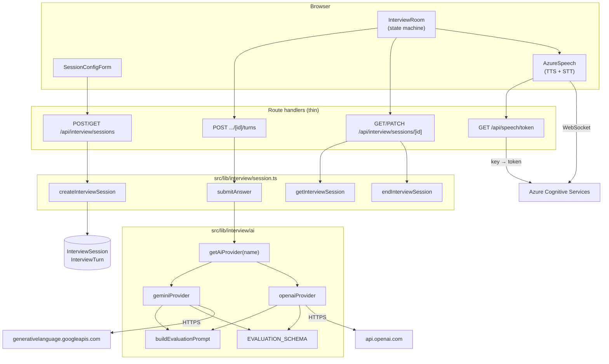
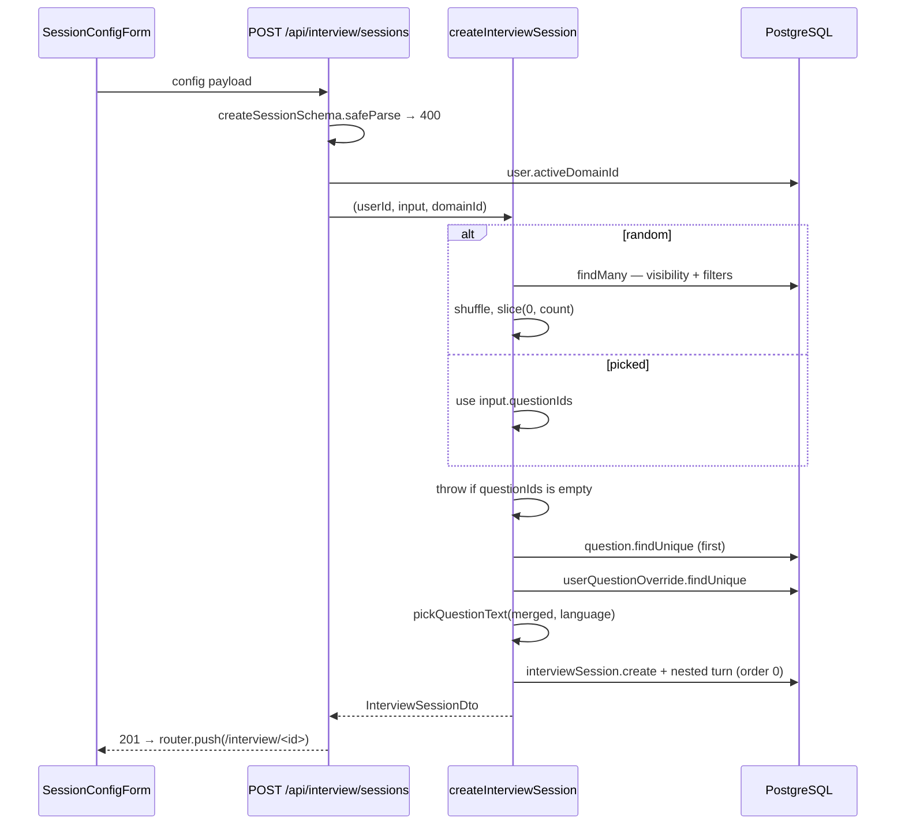
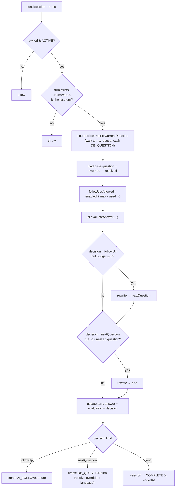
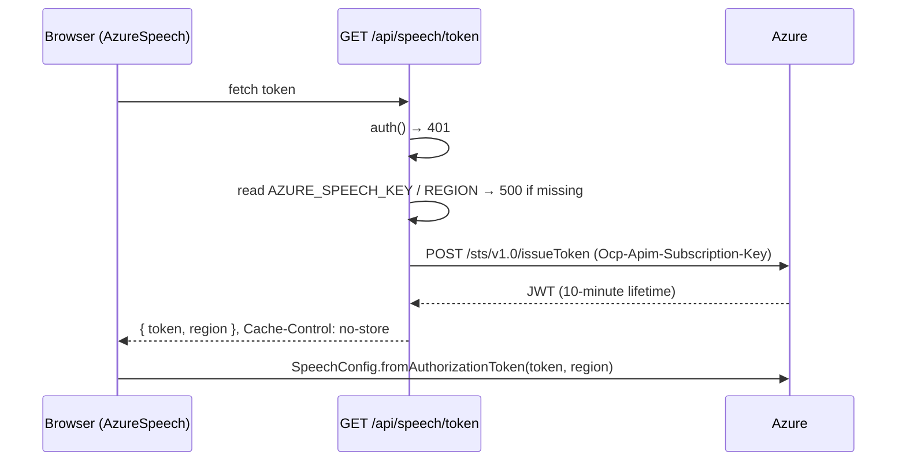
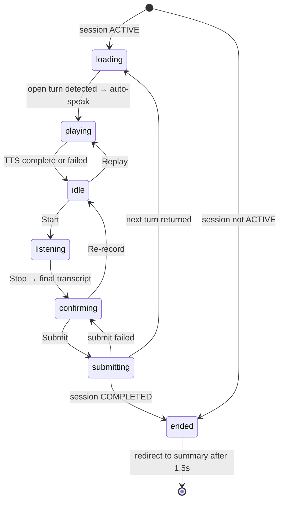

# Mock Interview — Design (as built)

> ⚠️ Built but **hidden** (nav entry commented out) and, per `MOCK_INTERVIEW_TODO.md`, **never run
> end-to-end**. This document describes the code as written.

## High-level architecture

Four layers, cleanly separated:

1. **UI** — a client-side state machine (`InterviewRoom`) plus a configuration form.
2. **Orchestration** — `src/lib/interview/session.ts` owns all turn/flow logic. The route handlers
   are thin wrappers.
3. **AI abstraction** — a provider interface with two implementations behind a factory.
4. **Speech** — a class wrapping the Azure SDK in the browser, with the subscription key kept
   server-side and exchanged for a short-lived token.



## Main entry points

| Entry point | File |
|---|---|
| Session list | `src/app/(main)/interview/page.tsx` |
| Configuration | `src/app/(main)/interview/new/page.tsx` → `src/components/interview/session-config-form.tsx` |
| Active room | `src/app/(main)/interview/[sessionId]/page.tsx` → `src/components/interview/interview-room.tsx` |
| Summary | `src/app/(main)/interview/[sessionId]/summary/page.tsx` |
| Session API | `src/app/api/interview/sessions/route.ts`, `.../[id]/route.ts`, `.../[id]/turns/route.ts` |
| Speech token | `src/app/api/speech/token/route.ts` |
| Orchestration | `src/lib/interview/session.ts` |
| AI providers | `src/lib/interview/ai/{index,types,gemini,openai,prompts,schema}.ts` |
| Speech client | `src/components/interview/azure-speech.ts` |
| Types / constants / schemas | `src/lib/interview/{types,constants}.ts`, `src/lib/validations/interview.ts` |

## Data model

```prisma
model InterviewSession {
  id        String          @id @default(cuid())
  userId    String
  domainId  String?
  status    InterviewStatus @default(ACTIVE)   // ACTIVE | COMPLETED | ABANDONED
  config    Json                                // InterviewConfig, untyped at rest
  startedAt DateTime        @default(now())
  endedAt   DateTime?
  turns     InterviewTurn[]
  @@index([userId, startedAt])
}

model InterviewTurn {
  id         String   @id @default(cuid())
  sessionId  String
  order      Int
  type       TurnType                 // DB_QUESTION | AI_FOLLOWUP
  questionId String?                  // set only for DB_QUESTION
  promptText String   @db.Text
  answerText String?  @db.Text
  evaluation Json?                    // { score, strengths[], gaps[] }
  decision   Json?                    // discriminated union on `kind`
  @@index([sessionId, order])
}
```

Two design choices stand out:

- **`config` is denormalized JSON** including the resolved `questionIds`. The question set is fixed
  at creation and the session is self-describing, but nothing validates the shape on read.
- **`promptText` is copied onto the turn** rather than referenced. This snapshots the wording at the
  moment it was asked, so later edits to the question do not rewrite history — and it is the only
  storage available for AI-generated follow-ups, which have no `Question` row.

## Important types

```ts
// src/lib/interview/types.ts
export type InterviewConfig = {
  selectionMode: "random" | "picked";
  questionIds: string[];                       // resolved at creation
  filters?: { topicIds?: string[]; subTopicIds?: string[];
              difficulties?: Difficulty[]; count: number };
  followUps: { maxPerQuestion: number; enabled: boolean };
  voice: { name: string; rate: number };
  ai: { provider: AiProviderName; model?: string };
  language: "en" | "vn";
};

export type SubmitAnswerResult = {
  evaluatedTurn: TurnDto;
  nextTurn: TurnDto | null;
  sessionStatus: "ACTIVE" | "COMPLETED" | "ABANDONED";
};

// src/lib/interview/ai/types.ts
export type EvaluationDecision =
  | { kind: "followUp"; question: string; reason: string }
  | { kind: "nextQuestion"; reason: string }
  | { kind: "end"; reason: string };

export type Evaluation = { score: number; strengths: string[]; gaps: string[] };

export interface InterviewAiProvider {
  readonly name: AiProviderName;
  evaluateAnswer(input: EvaluateAnswerInput): Promise<EvaluateAnswerOutput>;
}
```

`EvaluationDecision` is a discriminated union in TypeScript, but the JSON schema sent to the models
is **flat** — `question` is optional even when `kind` is `followUp` (see Technical Debt).

## Session creation



Random resolution reuses the question visibility rule but not the question read module:

```ts
const candidates = await prisma.question.findMany({
  where: {
    ...(domainId ? { domainId } : {}),
    OR: [{ isDefault: true }, { createdBy: userId, isDefault: false }],
    ...(filters.difficulties?.length ? { difficulty: { in: filters.difficulties } } : {}),
    ...(filters.topicIds?.length    ? { topics:    { some: { topicId:    { in: filters.topicIds } } } } : {}),
    ...(filters.subTopicIds?.length ? { subTopics: { some: { subTopicId: { in: filters.subTopicIds } } } } : {}),
  },
  select: { id: true },
});

const shuffled = [...candidates].sort(() => Math.random() - 0.5);
return shuffled.slice(0, filters.count).map((q) => q.id);
```

Note the filters *are* pushed into SQL here, unlike `getQuestionsForUser` which filters in memory —
because no override merge is needed for selection. The consequence is that `isHidden` is not
consulted at all.

## Answer submission — the core state machine

`submitAnswer` is the most involved function in the codebase. Its ordering matters:



Follow-up accounting walks the whole turn list:

```ts
for (const t of turns) {
  if (t.type === "DB_QUESTION") { currentQuestionId = t.questionId; followUpsUsed = 0; }
  else if (t.type === "AI_FOLLOWUP") { followUpsUsed += 1; }
}
```

The state is derived from the log rather than stored, so it cannot drift.

History passed to the model **excludes the current turn**, because the current prompt and answer are
supplied separately:

```ts
const historyExcludingCurrent = buildHistory(session.turns.slice(0, -1));
```

The two decision rewrites (MI-R44, MI-R45) are the server asserting control over an advisory model
output — the LLM cannot exceed the follow-up budget or invent extra questions.

## AI provider abstraction

`getAiProvider` resolves in priority order: explicit argument → `INTERVIEW_AI_PROVIDER` env →
`"gemini"`.

Both providers implement the same shape and share the same prompt builder and schema constants:

| | Gemini | OpenAI |
|---|---|---|
| Model | `GEMINI_MODEL` or `gemini-2.0-flash` | `OPENAI_MODEL` or `gpt-4o-mini` |
| Structured output | `generationConfig.responseSchema` | `response_format: json_schema, strict: true` |
| System prompt | `systemInstruction.parts` | a `system` message |
| Auth | `?key=` query parameter | `Authorization: Bearer` |
| Temperature | 0.4 | 0.4 |

Both call `fetch` directly — no SDK — and both parse the response with `JSON.parse` and cast to
`EvaluateAnswerOutput` without runtime validation.

The prompt (`buildEvaluationPrompt`) instructs the model to score 0–10, list strengths and gaps, and
pick exactly one action, and it states the remaining follow-up budget inline in both the system and
user messages. It also carries two explicit guardrails: *"Do not reveal the reference answer"* and,
when the budget is zero, the annotation `(cannot pick followUp)`.

## Speech

Key handling is the important part:



The subscription key never leaves the server; the browser receives only a short-lived token.
Freshness is checked lazily before each operation:

```ts
private async ensureFreshToken(): Promise<void> {
  const eightMinutes = 8 * 60 * 1000;
  if (Date.now() - this.tokenIssuedAt > eightMinutes) { /* refetch */ }
}
```

Eight minutes against a ten-minute token leaves a two-minute margin.

**Synthesis** builds SSML with escaped text:

```ts
const ssml = `<speak version="1.0" xml:lang="${localeFor(language)}">`
           + `<voice name="${voiceName}"><prosody rate="${rate.toFixed(2)}">`
           + `${escapeSsml(text)}</prosody></voice></speak>`;
```

**Recognition** uses continuous mode with two accumulators — `listeningFinal` for confirmed segments
and `listeningPartial` for the in-progress phrase — combined on every callback so the UI shows a
stable prefix plus a live tail.

## The room state machine

```ts
type RoomState =
  | "loading" | "idle" | "playing" | "listening"
  | "confirming" | "submitting" | "ended";
```



The open turn is derived, never stored:

```ts
function currentOpenTurn(session: InterviewSessionDto): TurnDto | null {
  if (session.status !== "ACTIVE") return null;
  const last = session.turns[session.turns.length - 1];
  if (!last || last.answerText) return null;
  return last;
}
```

Auto-play is guarded by a ref so a prompt is spoken once per turn:

```ts
const playedTurnIdsRef = useRef<Set<string>>(new Set());
useEffect(() => {
  if (!openTurn || playedTurnIdsRef.current.has(openTurn.id)) return;
  playedTurnIdsRef.current.add(openTurn.id);
  void playPrompt(openTurn);
}, [openTurn, playPrompt]);
```

After a successful submit the client merges the server's response into local state rather than
refetching:

```ts
setSession((prev) => {
  const updatedTurns = prev.turns.map((t) =>
    t.id === result.evaluatedTurn.id ? result.evaluatedTurn : t);
  if (result.nextTurn) updatedTurns.push(result.nextTurn);
  return { ...prev, status: result.sessionStatus, turns: updatedTurns };
});
```

## State management

| State | Mechanism |
|---|---|
| Session + turns (truth) | PostgreSQL, append-only turns |
| Room session copy | `useState`, seeded server-side, updated from submit responses |
| Room phase | `useState<RoomState>` |
| Speech client | `useRef<AzureSpeech>`, disposed on unmount |
| Played prompts | `useRef<Set<string>>` |
| Config form | ~11 `useState` values |
| Topics / questions for the form | SWR (`/api/topics`, conditionally `/api/questions?limit=500`) |

The active session page is server-rendered for the initial payload and then driven entirely
client-side — there is no polling and no `router.refresh()` during a session.

## Error handling

| Layer | Behavior |
|---|---|
| Route handlers | `try/catch` returning `400` with `err.message` |
| `submitAnswer` / `createInterviewSession` | Throw plain `Error`s with human-readable messages |
| Providers | Throw on missing key, non-OK response (including status + body), or empty content |
| Speech token route | `500` when unconfigured, `502` on upstream failure |
| `AzureSpeech` | Rejects promises; callers toast and reset state |
| Room | Toast per failure; `submitting` failure returns to `confirming` with the transcript intact |

There is no retry, backoff, or circuit breaker anywhere in the feature.

## Authorization

Ownership is enforced inside the orchestration layer, not the routes:

```ts
if (!session || session.userId !== userId) return null;      // getInterviewSession
if (!session || session.userId !== userId) throw new Error("Session not found");  // submitAnswer
```

A foreign session is reported as not-found rather than forbidden, so session ids are not confirmable.

## Dependencies on other features

| Feature | Coupling |
|---|---|
| [Questions management](../questions-management/) | Reuses the visibility rule (re-implemented, not imported); reads question text, answer, difficulty |
| [Question overrides](../question-overrides/) | Merges overrides with its own third implementation; ignores `isHidden` |
| [Domains](../domains/) | Session stamped with the active domain; random selection scoped to it |
| [Topics & sub-topics](../topics-subtopics/) | Filters in random mode |
| [Authentication](../authentication/) | Session required everywhere; ownership checks |

## External dependencies

| Dependency | Purpose | Environment |
|---|---|---|
| Azure Cognitive Services Speech | TTS + STT | `AZURE_SPEECH_KEY`, `AZURE_SPEECH_REGION` |
| Google Gemini | Evaluation | `GEMINI_API_KEY`, optional `GEMINI_MODEL` |
| OpenAI | Evaluation | `OPENAI_API_KEY`, optional `OPENAI_MODEL` |
| — | Default provider | optional `INTERVIEW_AI_PROVIDER` |
| `microsoft-cognitiveservices-speech-sdk` | Browser speech client | — |

## Implementation decisions worth noting

1. **Provider interface + factory.** Adding a third provider means one file implementing
   `InterviewAiProvider`; the prompt and schema are shared.
2. **Structured output enforced at the API level** rather than by parsing prose, which is what makes
   the decision handling tractable.
3. **Server overrides the model's decision** when the budget or question set is exhausted — the LLM
   advises, the server decides.
4. **Turn log as the source of truth.** Follow-up counts, the current question, and the open turn are
   all derived by walking the turns, so no denormalized counters can drift.
5. **`promptText` snapshotted per turn**, preserving history and accommodating AI-generated prompts.
6. **Token exchange server-side** so the Azure subscription key never reaches the browser.
7. **Transcript confirmation step** — an explicit acknowledgement that speech-to-text mishandles
   technical vocabulary; the UI says so to the user.
8. **Client-side merge instead of refetch** after submit, keeping the interview responsive.

---

## Observed Technical Debt

1. **Never verified end-to-end.** `MOCK_INTERVIEW_TODO.md` lists a 17-item manual checklist, none of
   it done. The feature is hidden precisely because it is unproven.
2. **No database migration exists.** The tables were created with `prisma db push`; the TODO records
   a pre-existing shadow-database blocker that must be fixed before `migrate dev` will work. Deploying
   to a fresh database would fail.
3. **LLM output is rendered with `dangerouslySetInnerHTML`.** `AI_FOLLOWUP.promptText` is model output
   injected into the DOM unsanitized, in the room, the conversation log, and the summary. This is the
   most serious issue in the feature.
4. **Raw provider errors are returned to the client** as `400` bodies, including upstream status codes
   and response text.
5. **The follow-up decision schema does not require `question`.** `EVALUATION_PROPERTIES.decision`
   marks only `kind` and `reason` as required, so a `followUp` without a question would create a turn
   with `promptText: undefined`.
6. **Provider responses are cast, not validated.** `JSON.parse(text) as EvaluateAnswerOutput` — a
   malformed or schema-violating response propagates as a runtime error later.
7. **Biased shuffle.** `sort(() => Math.random() - 0.5)` does not produce a uniform permutation.
8. **The full candidate pool is fetched before shuffling**, regardless of the requested count.
9. **Hidden questions are not excluded** from selection — `isHidden` is never consulted here.
10. **A third override merge implementation**, covering five of seven fields and duplicated twice
    within the same file. See [`../question-overrides/design.md`](../question-overrides/design.md).
11. **The visibility rule is re-implemented** rather than shared with `src/lib/questions.ts`.
12. **`config` is cast with `as unknown as InterviewConfig`** with no runtime validation, so a session
    created under an older shape would fail unpredictably.
13. **The Azure token endpoint is unthrottled.** Any signed-in user can mint tokens repeatedly and use
    them directly against the account owner's Azure resource.
14. **Token refresh is not proactive** — a token expiring mid-recognition is not renewed.
15. **Speech is not stopped on turn change**, only on unmount, allowing overlapping audio.
16. **No retry or backoff** on transient Azure or LLM failures, explicitly noted as a known gap in the
    TODO.
17. **`ai.model` is accepted by the schema and stored in the config but never used.**
18. **`voice.name` is unvalidated** against the known voice list.
19. **`questionIds` in picked mode are unvalidated** for existence, ownership, or domain.
20. **No concurrency control on answer submission** — the "latest open turn" check is not
    transactional.
21. **The `"loading"` state has no timeout**; if the next-turn effect never fires the room sits there
    indefinitely.
22. **The abandon handler ignores the response**, navigating to the summary even if the `PATCH` failed.
23. **The average score mixes referenced and unreferenced evaluations**, since follow-up turns are
    graded without a reference answer.
24. **Language fallback is per field**, so a Vietnamese session can silently ask an English question or
    grade against an English reference answer.
25. **`session-config-form.tsx` holds eleven independent `useState` values** with no reducer or form
    library, unlike the rest of the app which uses `react-hook-form` for comparable forms.
26. **The picked-mode list is hard-capped at 500** questions with no search or pagination.
</content>
