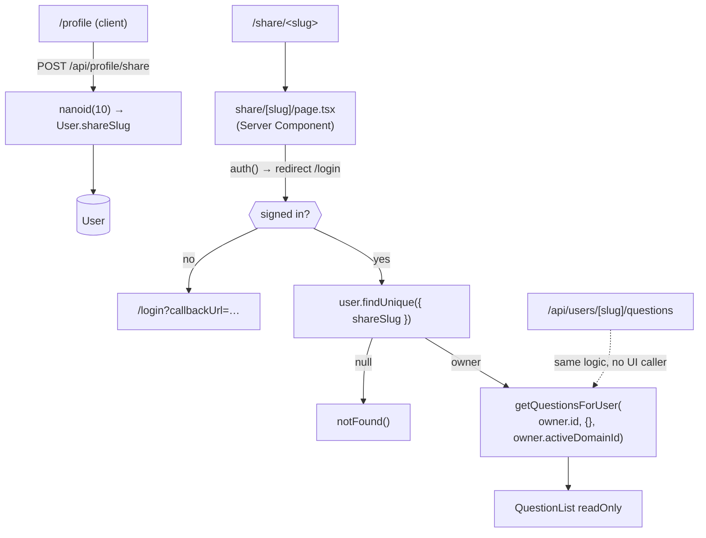
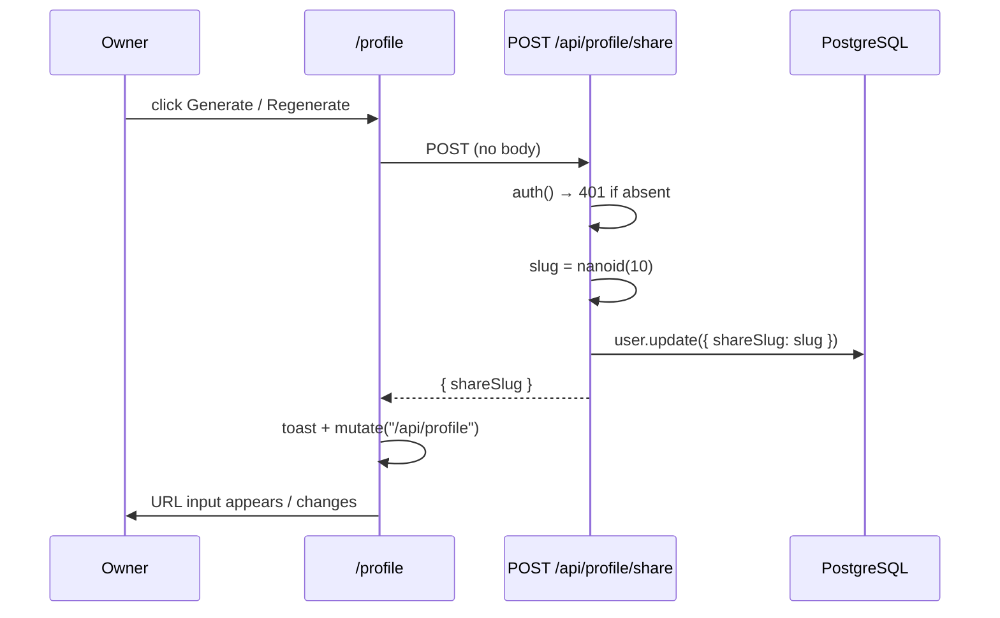

# Profile Sharing — Design (as built)

## High-level architecture

Sharing is a thin layer over the existing question-read pipeline. The only new state is a single
column — `User.shareSlug` — and the only new logic is "resolve slug → userId, then run the normal
read as that user".



The key substitution is in the call to `getQuestionsForUser`: it is invoked with the **owner's** id
and the **owner's** domain, while the session belongs to the viewer. That single swap is what makes
the whole feature work — every override, star, and visibility rule is evaluated from the owner's
perspective automatically.

## Main entry points

| Entry point | File |
|---|---|
| Profile page | `src/app/(main)/profile/page.tsx` |
| Profile API | `src/app/api/profile/route.ts` (`GET`, `PUT`) |
| Share-link API | `src/app/api/profile/share/route.ts` (`POST`) |
| Shared page | `src/app/share/[slug]/page.tsx` |
| Shared JSON API | `src/app/api/users/[slug]/questions/route.ts` (`GET`) — **unused by the UI** |
| Read-only rendering | `src/components/questions/question-list.tsx`, `question-card.tsx` (`readOnly` prop) |

## Data model

```prisma
model User {
  shareSlug String? @unique
  // …
}
```

That is the entire schema footprint. There is no `Share` entity, no per-link record, no audit trail,
and no expiry column — which is why revocation, expiry, and view counts are all absent from the
feature.

## Route placement

`/share/[slug]` sits at `src/app/share/[slug]/page.tsx` — **outside** the `(main)` route group. That
is deliberate: it does not inherit `src/app/(main)/layout.tsx`, so the shared page renders without
the app header, the domain badge, the user menu, or the sidebar. It provides its own centered
container:

```tsx
<div className="mx-auto max-w-4xl space-y-6 p-4 md:p-6">
```

It is still covered by `src/middleware.ts` (the matcher excludes only static assets), so an
anonymous request is redirected before the page runs — and the page's own `auth()` check is a second
line of defence.

## Data flow

### Generating a slug



The handler is five lines and does no collision handling:

```ts
const slug = nanoid(10);
const user = await prisma.user.update({
  where: { id: session.user.id },
  data: { shareSlug: slug },
  select: { shareSlug: true },
});
```

A collision on the unique index would surface as an unhandled `P2002` → `500`. With a 64-character
alphabet and length 10 the probability is negligible in practice, but there is no retry.

### Rendering a shared collection

```ts
// src/app/share/[slug]/page.tsx
const session = await auth();
if (!session?.user) redirect("/login");          // viewer must be signed in

const { slug } = await params;
const targetUser = await prisma.user.findUnique({
  where: { shareSlug: slug },
  select: { id: true, name: true, email: true,
            activeDomainId: true, activeDomain: { select: { name: true } } },
});
if (!targetUser) notFound();

const questions = await getQuestionsForUser(targetUser.id, {}, targetUser.activeDomainId);
```

Three details matter:

1. **`targetUser.id`, not `session.user.id`** — the read is performed *as the owner*, so
   `getQuestionsForUser` fetches the owner's overrides and the owner's stars.
2. **`{}` for filters** — no filtering is possible on this page, and the default `limit` of 50
   therefore applies (PS-X2).
3. **`targetUser.activeDomainId`** — the owner's domain, not the viewer's.

`email` is selected but never rendered — it is dead in the query.

### Read-only rendering

`QuestionList` receives `readOnly` and passes it to every card. `QuestionCard` branches on it:

```tsx
{readOnly ? (
  important && (
    <Star aria-label="Important" className="h-4 w-4 shrink-0 fill-amber-400 text-amber-500" />
  )
) : (
  <div className="flex shrink-0 items-center gap-1">
    {/* star toggle button, edit link, delete button */}
  </div>
)}
```

In read-only mode the star becomes a static indicator rather than a control, and it reflects
`question.isImportant` — which, because the read ran as the owner, is the **owner's** star (PS-X6).

`QuestionList` also omits `onDelete` wiring in practice, since `readOnly` cards never render the
delete button. The width/font controls are *not* gated by `readOnly`, so viewers keep them
(PS-X15).

### Profile page state

Three independent data sources on one page:

```ts
const { data: session, update: updateSession } = useSession();
const { mutate: globalMutate } = useSWRConfig();
const { data: profile, mutate } = useSWR("/api/profile", fetcher);
const { data: domains } = useSWR("/api/domains", fetcher);
```

- The **email** input reads from `session.user.email`.
- The **name** input reads from local state falling back to the profile: `value={name || profile?.name || ""}` (PS-X12).
- The **share URL** is derived from the profile plus `window.location.origin`, guarded for SSR:

```ts
const shareUrl =
  profile?.shareSlug && typeof window !== "undefined"
    ? `${window.location.origin}/share/${profile.shareSlug}`
    : null;
```

## The unused JSON endpoint

`src/app/api/users/[slug]/questions/route.ts` re-implements the page's logic and returns JSON:

```ts
const targetUser = await prisma.user.findUnique({
  where: { shareSlug: slug },
  select: { id: true, name: true, activeDomainId: true,
            activeDomain: { select: { name: true } } },
});
if (!targetUser) return NextResponse.json({ error: "User not found" }, { status: 404 });

const questions = await getQuestionsForUser(targetUser.id, {}, targetUser.activeDomainId);
return NextResponse.json({ user: targetUser, questions });
```

A search of the codebase finds **no caller**. It behaves identically to the page except that it
returns `404` JSON instead of `notFound()`, and it exposes the owner's internal `id`.

## API summary

| Endpoint | Method | Auth | Body | Response |
|---|---|---|---|---|
| `/api/profile` | `GET` | session | – | `{ id, name, email, image, shareSlug, role, activeDomainId, activeDomain }` |
| `/api/profile` | `PUT` | session | `{ name }` (unvalidated) | `{ id, name, email, image, shareSlug }` |
| `/api/profile/share` | `POST` | session | none | `{ shareSlug }` |
| `/api/users/[slug]/questions` | `GET` | session | – | `{ user, questions }` or `404` |

`PUT /api/profile` is the only mutating endpoint in the app with **no Zod schema at all**:

```ts
const body = await req.json();
const { name } = body;
const user = await prisma.user.update({
  where: { id: session.user.id },
  data: { name },
  select: { id: true, name: true, email: true, image: true, shareSlug: true },
});
```

## State management

| State | Mechanism |
|---|---|
| `shareSlug` | PostgreSQL; SWR-cached under `/api/profile` |
| Share URL | Derived client-side from the slug + `window.location.origin` |
| Name field | Local `useState`, falling back to the SWR profile |
| Shared question list | Server-rendered per request; no cache |
| Post-generate refresh | `mutate("/api/profile")` |

## Error handling

| Site | Behavior |
|---|---|
| All profile endpoints without a session | `401 { error: "Unauthorized" }` |
| `/share/[slug]` unknown slug | `notFound()` |
| `/api/users/[slug]/questions` unknown slug | `404 { error: "User not found" }` |
| Generate failure | `toast.error("Failed to generate link")` |
| Name update failure | `toast.error("Failed to update")` |
| `nanoid` collision | **Unhandled** → `500` |
| Clipboard write | **Unhandled** — `navigator.clipboard.writeText(...)` is not awaited and the success toast fires unconditionally |

## Authentication / authorization

- **Owner-side** endpoints are scoped to `session.user.id`; no endpoint accepts a target user id, so
  cross-user profile access is structurally impossible.
- **Viewer-side** access is gated only by (a) having a session and (b) knowing the slug. There is no
  per-viewer permission model — the slug *is* the capability token.
- The middleware handles the anonymous redirect; the page repeats the check.

## Dependencies on other features

| Feature | Coupling |
|---|---|
| [Questions management](../questions-management/) | Reuses `getQuestionsForUser` and `QuestionList` wholesale; inherits the 50-item cap |
| [Question overrides](../question-overrides/) | The shared view renders the owner's *effective* content, so viewers see the owner's customizations and not their hidden questions |
| [Domains](../domains/) | Scoped to the owner's active domain |
| [Authentication](../authentication/) | Viewer session required; `updateSession` used for the name change |

## Implementation decisions worth noting

1. **Reuse the read pipeline with a substituted user id.** The entire feature is essentially one
   parameter change, which guarantees the shared view stays consistent with the owner's own view as
   the question logic evolves.
2. **A slug column rather than a `Share` entity.** Minimal schema, at the cost of making revocation,
   expiry, multiple links, and audit logging impossible without a migration.
3. **Route placed outside `(main)`** so the shared page renders standalone, without app chrome that
   would be confusing or misleading to a viewer.
4. **`readOnly` prop threaded through the existing components** rather than building a separate
   read-only card, keeping rendering consistent.
5. **Login required for viewers.** Not stated as a rationale anywhere in the code, but it is
   consistent with the middleware treating everything except `/`, `/login`, `/register` as private.
6. **Client-side URL construction** avoids needing a configured base URL on the server.

---

## Observed Technical Debt

1. **"Sharing" requires the recipient to have an account (PS-X1).** This is the single biggest gap
   between the feature's name and its behavior. The UI discloses it, but it makes the link useless
   for anyone outside the app.
2. **The shared collection is silently truncated at 50 questions (PS-X2)** by the default page size,
   with no pagination and no "showing 50 of N" indicator.
3. **There is no revoke (PS-X4).** `shareSlug` can be replaced but never cleared — the API offers no
   `DELETE`.
4. **`PUT /api/profile` has no validation at all (PS-V2, PS-X10).** It is the only mutating endpoint
   in the codebase without a Zod schema; `name` is destructured from the raw body and passed to
   Prisma.
5. **`GET /api/users/[slug]/questions` is dead code (PS-R26)** that duplicates the page's logic and
   additionally leaks the owner's internal `id`.
6. **No collision handling on `nanoid` (PS-E6).** A `P2002` would surface as a `500` with no retry.
7. **The clipboard success toast is unconditional (PS-E7).** `navigator.clipboard.writeText` is not
   awaited and its rejection is unhandled, so a failed copy still reports success.
8. **`email` is selected but never used** in the shared page's query.
9. **Related-question links break out of the shared view (PS-X16).** They point at `/questions#q-<id>`,
   the viewer's own list, where the target is usually absent.
10. **Star semantics are unexplained (PS-X6).** Viewers see the owner's stars with no label
    distinguishing them from their own.
11. **The name update does not refresh the session display (PS-X11)** because the `jwt` callback
    ignores everything but `activeDomainId` on update.
12. **A domain-less owner shares across all domains (PS-X8)**, because the `null` domain causes
    `getQuestionsForUser` to skip the filter entirely — the opposite of what the topics endpoint does
    with the same input.
13. **No share management or visibility (PS-X14).** The owner cannot tell whether the link has been
    used, and there is nothing to review or audit.
14. **Sharing exposes private questions and overrides (PS-B4)** with no scoping option and no warning
    beyond a one-line description.
</content>
