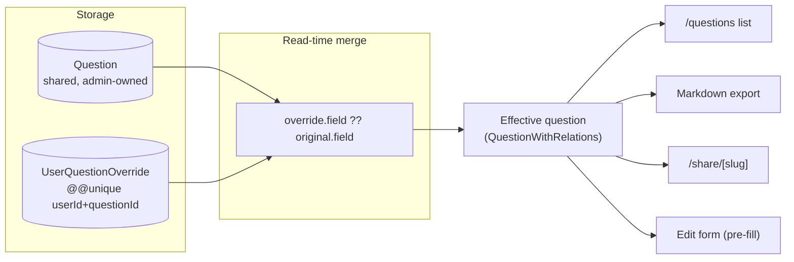
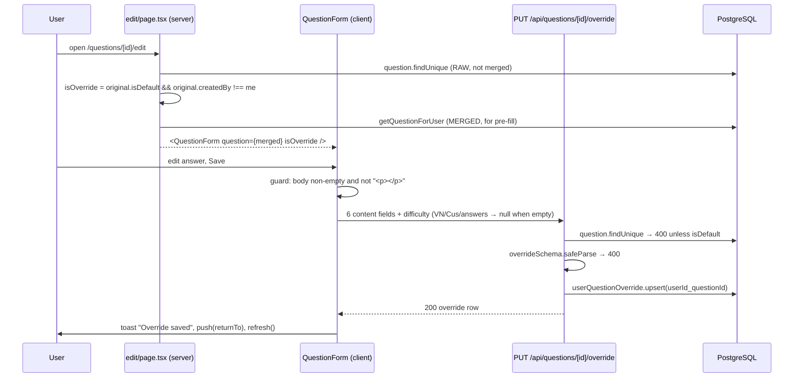
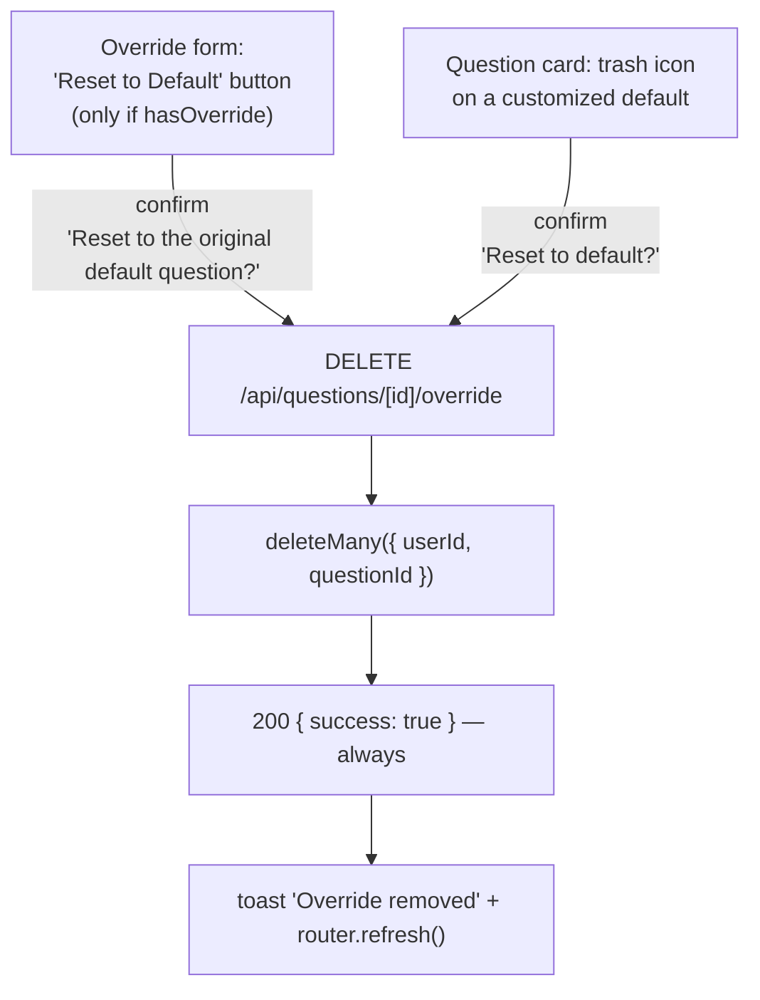

# Question Overrides — Design (as built)

## High-level architecture

The override system is a **side-table + read-time merge**. The shared `Question` row is never
mutated by a user; instead a `UserQuestionOverride` row holds only the fields that user changed, and
every read path coalesces the two.



The three properties this buys:

| Property | Mechanism |
|---|---|
| Non-destructive | The admin row is only ever written by `PUT /api/questions/[id]` |
| Reversible | Reset = delete the side row; the original is untouched and reappears |
| Per-field | Merge happens field by field, so an admin edit to an un-overridden field still lands |

## Main entry points

| Entry point | File |
|---|---|
| Override API | `src/app/api/questions/[id]/override/route.ts` (`PUT`, `DELETE`) |
| Mode decision | `src/app/(main)/questions/[id]/edit/page.tsx` |
| Override form | `src/components/questions/question-form.tsx` (`isOverride` prop) |
| Reset from list | `src/components/questions/question-list.tsx` (`handleDelete`) |
| Merge implementation | `src/lib/questions.ts` |
| Badge | `src/components/questions/question-card.tsx` |
| Schema | `src/lib/validations/question.ts` (`overrideSchema`) |

## Data model

```prisma
model UserQuestionOverride {
  id          String      @id @default(cuid())
  userId      String
  questionId  String
  question    String?     @db.Text
  questionVn  String?     @db.Text
  questionCus String?     @db.Text
  answer      String?     @db.Text
  answerVn    String?     @db.Text
  answerCus   String?     @db.Text
  difficulty  Difficulty?
  isHidden    Boolean     @default(false)
  createdAt   DateTime    @default(now())
  updatedAt   DateTime    @updatedAt

  user             User     @relation(fields: [userId],     references: [id], onDelete: Cascade)
  originalQuestion Question @relation(fields: [questionId], references: [id], onDelete: Cascade)

  @@unique([userId, questionId])
  @@index([userId])
}
```

Every content column is nullable, and `difficulty` is nullable even though `Question.difficulty` is
not. Null carries the meaning **"not overridden — use the original"**, which is exactly what the
`??` merge implements.

`@@unique([userId, questionId])` is what makes the endpoint an upsert. `@@index([userId])` supports
the bulk fetch described below.

The parallel model `UserQuestionStar` uses the same shape and rationale — per-user state kept off the
shared row — and its schema comment says so explicitly.

## The merge

### List path — `getQuestionsForUser`

```ts
const [questions, overrides, stars] = await Promise.all([
  prisma.question.findMany({ /* domain + visibility */ }),
  prisma.userQuestionOverride.findMany({ where: { userId } }),   // ALL of the user's overrides
  prisma.userQuestionStar.findMany({ where: { userId }, select: { questionId: true } }),
]);

const overrideMap = new Map(overrides.map((o) => [o.questionId, o]));

let merged = questions.map((q) => {
  const override = overrideMap.get(q.id);
  if (override?.isHidden) return null;                 // hidden → dropped entirely

  return {
    id: q.id,
    question:    override?.question    ?? q.question,
    questionVn:  override?.questionVn  ?? q.questionVn,
    questionCus: override?.questionCus ?? q.questionCus,
    answer:      override?.answer      ?? q.answer,
    answerVn:    override?.answerVn    ?? q.answerVn,
    answerCus:   override?.answerCus   ?? q.answerCus,
    difficulty:  override?.difficulty  ?? q.difficulty,
    isDefault: q.isDefault,                            // never overridden
    createdBy: q.createdBy,                            // never overridden
    createdAt: q.createdAt, updatedAt: q.updatedAt,
    hasOverride: !!override,
    isImportant: starredIds.has(q.id),
    topics: q.topics, subTopics: q.subTopics, relatedTo: q.relatedTo,
  };
}).filter((q) => q !== null);
```

Three deliberate details:

1. **The override fetch is unfiltered by question id.** It pulls every override the user has, then
   builds a `Map`. This is one query instead of N, but it scales with the user's total override
   count rather than with the page.
2. **`??` not `||`.** Nullish coalescing means an override of `""` or `0` wins, while `null` falls
   back. This is what produces edge case OV-X2.
3. **Hidden filtering happens before the field merge** and returns `null`, removed by the subsequent
   `.filter()`.

Critically, this merge runs **before** the difficulty/search/sort logic, so overridden values
participate in filtering — see [`../questions-management/design.md`](../questions-management/design.md).

### Detail path — `getQuestionForUser`

Same merge, three parallel single-row lookups, **and no `isHidden` check**:

```ts
const [question, override, star] = await Promise.all([
  prisma.question.findUnique({ where: { id: questionId }, include: { … } }),
  prisma.userQuestionOverride.findUnique({ where: { userId_questionId: { userId, questionId } } }),
  prisma.userQuestionStar.findUnique({ where: { userId_questionId: { userId, questionId } }, select: { id: true } }),
]);
if (!question) return null;
return { …merged… };
```

The missing hidden check is the source of OV-X7.

### Interview path — a third, independent merge

`src/lib/interview/session.ts` does **not** call either helper. It inlines its own merge twice:

```ts
const resolvedQuestion = {
  question:   override?.question   ?? baseQuestion.question,
  questionVn: override?.questionVn ?? baseQuestion.questionVn,
  answer:     override?.answer     ?? baseQuestion.answer,
  answerVn:   override?.answerVn   ?? baseQuestion.answerVn,
  difficulty: override?.difficulty ?? baseQuestion.difficulty,
};
```

It covers five fields (no `questionCus` / `answerCus`, which the interview does not use) and ignores
`isHidden`. That is OV-X11.

## Data flow

### Save an override



The edit page performs **two** reads of the same question: the raw row to decide the mode (ownership
is a property of the original) and the merged view to pre-fill the form.

### Reset

Two entry points converge on the same endpoint:



`question-list.tsx` decides which endpoint to call:

```ts
const isOverrideReset = question.isDefault && question.hasOverride;
const endpoint = isOverrideReset
  ? `/api/questions/${id}/override`     // reset — non-destructive
  : `/api/questions/${id}`;             // real delete
```

Inverting that condition would destroy shared default questions instead of resetting a personal
customization — the single most dangerous line in the feature.

## The API

### `PUT`

```ts
const question = await prisma.question.findUnique({ where: { id: questionId } });
if (!question || !question.isDefault) {
  return NextResponse.json({ error: "Can only override default questions" }, { status: 400 });
}

const parsed = overrideSchema.safeParse(body);
if (!parsed.success) return 400;

const override = await prisma.userQuestionOverride.upsert({
  where:  { userId_questionId: { userId: session.user.id, questionId } },
  create: { userId: session.user.id, questionId, ...parsed.data },
  update: parsed.data,
});
```

Because every field in `overrideSchema` is optional, `parsed.data` contains only the keys present in
the request body. Spreading it into `update` therefore gives **partial-update semantics**: omitted
fields keep their stored values. The current UI never exercises this — `QuestionForm` always sends
all seven fields — but the API supports `PUT { difficulty: "HARD" }` on its own.

Note there is **no `404`**: a missing question and a non-default question return the same `400`.

### `DELETE`

```ts
await prisma.userQuestionOverride.deleteMany({
  where: { userId: session.user.id, questionId },
});
return NextResponse.json({ success: true });
```

`deleteMany` rather than `delete` so a missing row is not an error. No existence check, no `404`,
always `200`.

## Mode selection in the UI

```ts
// src/app/(main)/questions/[id]/edit/page.tsx
const original = await prisma.question.findUnique({ where: { id } });
if (!original) notFound();
const question = await getQuestionForUser(session.user.id, id);
if (!question) notFound();

const isOverride = original.isDefault && original.createdBy !== session.user.id;
```

| `isDefault` | Creator is me | Mode | Endpoint |
|---|---|---|---|
| `false` | yes | direct edit | `PUT /api/questions/[id]` |
| `false` | no | direct edit → **`403` from the API** | `PUT /api/questions/[id]` |
| `true` | yes (admin author) | direct edit | `PUT /api/questions/[id]` |
| `true` | no | **override** | `PUT /api/questions/[id]/override` |

Row 2 is reachable only by typing another user's question id into the URL: the page renders an
edit form that will be rejected on save.

`QuestionForm` then hides the non-overridable controls:

```tsx
{isAdmin && !isOverride && ( /* isDefault checkbox */ )}
{!isOverride && ( /* topics, sub-topics, related questions */ )}
{isOverride && question?.hasOverride && ( /* Reset to Default button */ )}
```

## Payload construction

```ts
const body = isOverride
  ? {
      question:    formData.question,              // NOT || null
      questionVn:  formData.questionVn  || null,
      questionCus: formData.questionCus || null,
      answer:      formData.answer      || null,
      answerVn:    formData.answerVn    || null,
      answerCus:   formData.answerCus   || null,
      difficulty:  formData.difficulty,
    }
  : { ...formData, /* same || null treatment */ };
```

The English `question` field is the only one not passed through `|| null`. Combined with the `??`
merge, that is precisely why the English body can be blanked while the other five cannot (OV-X1,
OV-X2). Both branches share the asymmetry, but it only *matters* in override mode.

`isHidden` is absent from both branches — the UI never writes it.

## State management

| State | Mechanism |
|---|---|
| Override content | PostgreSQL; no client cache of its own |
| Effective content | Recomputed server-side on every request; never cached |
| `hasOverride` | Derived at read time (`!!override`), never stored |
| Form values | Local `useState` in `QuestionForm`, seeded from the merged question |
| Post-mutation refresh | `router.push(returnTo)` + `router.refresh()` |

There is no optimistic update for overrides — the round-trip completes before navigation.

## Error handling

| Condition | Response / behavior |
|---|---|
| No session | `401 { error: "Unauthorized" }` |
| Question missing **or** not default | `400 { error: "Can only override default questions" }` |
| Schema failure | `400` with `issues[0].message` |
| `DELETE` with no existing override | `200 { success: true }` |
| Save failure (form) | toast with server `error`, fallback "Failed to save" |
| Reset failure (form) | toast "Failed to reset" |
| Reset failure (list) | toast "Something went wrong" |

## Authorization

Every operation is implicitly scoped to `session.user.id`, which is read from the session and never
from the request body. There is no endpoint that accepts a `userId`, so cross-user override access
is structurally impossible rather than merely checked.

The one gap: `PUT` verifies the question is a default but **not** that the caller can see it — no
domain check, no visibility check (OV-P2). Since all defaults in all domains are equally
"overridable", a user could create an override for a default in a domain they have never activated.
It would simply never surface in their list.

## Dependencies on other features

| Feature | Coupling |
|---|---|
| [Questions management](../questions-management/) | Overrides only exist for defaults; the merge lives inside the shared read helpers; delete-vs-reset dispatch is in `QuestionList` |
| [Authentication](../authentication/) | `session.user.id` scopes every row; `role` decides who authors defaults in the first place |
| [Domains](../domains/) | Indirect — overrides inherit the question's domain |
| [Profile sharing](../profile-sharing/) | The shared view renders the owner's **effective** collection, so viewers see the owner's overrides |
| [Mock interview](../mock-interview/) | Re-implements the merge inline over five fields |

## Implementation decisions worth noting

1. **Side table over row mutation.** The alternative — copy-on-write into a private question — would
   fork the content permanently and break the link to admin updates. The side table keeps the
   original authoritative for every un-overridden field.
2. **Nullable columns + `??` as the encoding of "not overridden".** Compact and requires no extra
   "which fields are overridden" metadata, at the cost of making "override to empty" inexpressible
   (OV-X1).
3. **Merge at read time, not write time.** Guarantees admin edits propagate to fields the user has
   not touched, and makes reset a single delete. The cost is that the merge cannot happen in SQL, so
   filtering and sorting must be done in application memory
   (see [`../questions-management/design.md`](../questions-management/design.md)).
4. **Bulk-fetch all of a user's overrides per request** rather than joining. Keeps the query count at
   three regardless of page size.
5. **`deleteMany` for reset** so the operation is idempotent and never 404s.
6. **Upsert keyed on the composite unique** so the client does not need to know whether an override
   already exists.
7. **Two reads on the edit page** (raw + merged) because the mode decision depends on the original's
   ownership while the form needs the merged content.

---

## Observed Technical Debt

1. **You cannot override a field to be empty (OV-X1).** `??` treats `null` as "use the original", so
   clearing a translated answer silently restores the admin's. There is no sentinel for "deliberately
   blank".
2. **The English question body is inconsistent with the other five fields (OV-X2).** It is sent raw
   rather than `|| null`, so it *can* be blanked — producing a question card with no title. Almost
   certainly unintentional.
3. **Saving with no changes creates an override row (OV-X3, OV-X5)** and a permanent "Customized"
   badge, because the form always submits all fields. Nothing compares the payload against the
   original before writing.
4. **`isHidden` is a dead path in the UI (OV-X6).** It is validated, stored, and honoured on read, but
   no component ever sets it. Either the UI was dropped or the field is speculative — this should be
   resolved rather than left ambiguous.
5. **`getQuestionForUser` ignores `isHidden` (OV-X7)**, so the list and the detail view disagree about
   whether a hidden question exists.
6. **The merge is implemented three times** — `getQuestionsForUser`, `getQuestionForUser`, and twice
   inline in `src/lib/interview/session.ts`. The interview copy covers five of the seven fields and
   ignores hiding. There is no shared `mergeOverride(question, override)` function.
7. **`PUT` conflates "not found" with "not a default" (OV-E2).** A typo'd id and a legitimate
   permission failure return the same `400` and the same message.
8. **`PUT` does not check question visibility (OV-P2)** — only that it is a default.
9. **`/admin/questions` hard-codes `hasOverride: false` (OV-X9)** and skips the merge entirely, so an
   admin sees originals there and their own customizations on `/questions`.
10. **No cleanup of no-op overrides (OV-X12).** All-null rows accumulate and keep displaying the
    "Customized" badge.
11. **Users are never told the underlying default changed (OV-X4).** There is no version marker, diff,
    or staleness indicator, so a user can silently keep an answer that no longer matches the question.
12. **Orphaned overrides when `isDefault` is flipped off (OV-X13)** remain in the table, still applied
    on read but no longer editable through the API.
13. **`overrideSchema` has no minimum length on `question` (OV-V2)** while `questionSchema` does — the
    two schemas disagree about what a valid question body is.
14. **Reset is all-or-nothing.** There is no way to revert a single field.
15. **The delete-vs-reset decision lives in a client component** (`question-list.tsx`) rather than
    being enforced server-side. A client that calls `DELETE /api/questions/[id]` directly on a
    customized default gets the permission check as its only protection — which is adequate for
    non-admins but means an admin can destroy a shared question where the UI would have offered a
    reset.
</content>
