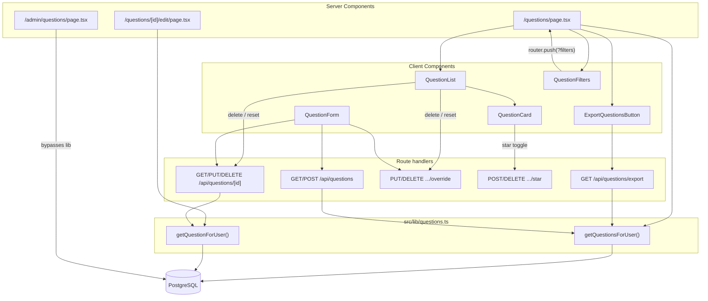
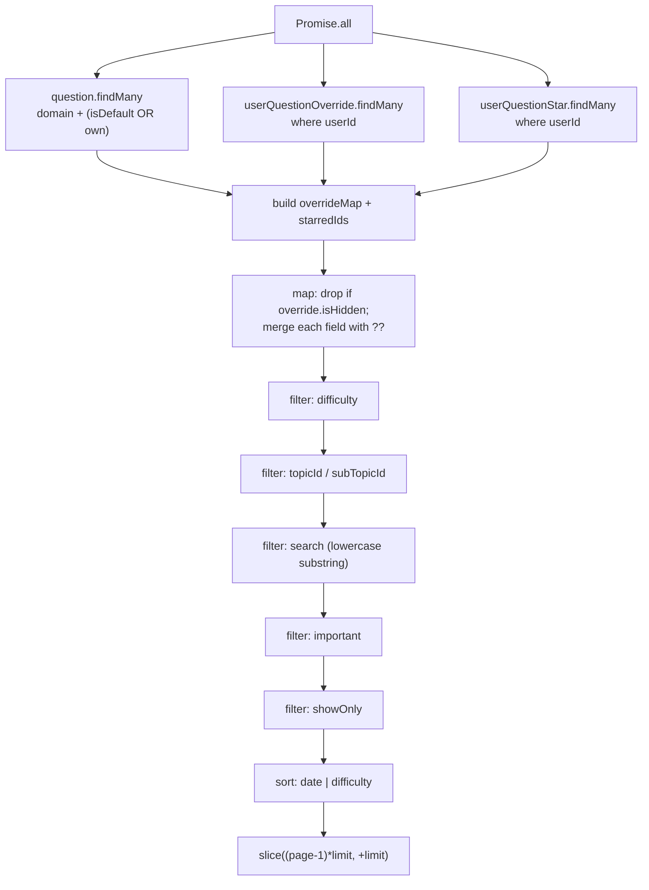
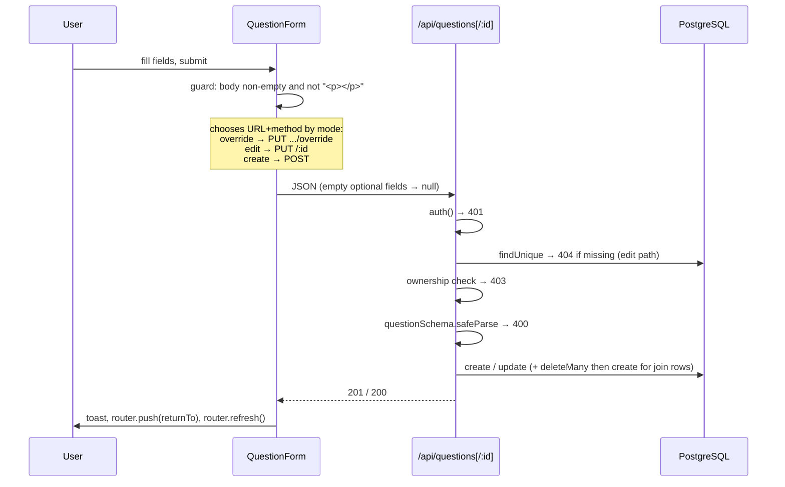

# Questions Management — Design (as built)

## High-level architecture

Reads are centralized in one module (`src/lib/questions.ts`); writes are spread across four route
handlers. The list page is a **Server Component** that calls the read module directly, while
mutations go through `fetch` from client components and rely on `router.refresh()` to re-render the
server tree.



## Main entry points

| Entry point | File |
|---|---|
| List page | `src/app/(main)/questions/page.tsx` |
| Create page | `src/app/(main)/questions/new/page.tsx` |
| Edit page | `src/app/(main)/questions/[id]/edit/page.tsx` |
| Admin defaults page | `src/app/(main)/admin/questions/page.tsx` |
| Collection API | `src/app/api/questions/route.ts` (`GET`, `POST`) |
| Item API | `src/app/api/questions/[id]/route.ts` (`GET`, `PUT`, `DELETE`) |
| Star API | `src/app/api/questions/[id]/star/route.ts` (`POST`, `DELETE`) |
| Override API | `src/app/api/questions/[id]/override/route.ts` — see [`../question-overrides/`](../question-overrides/) |
| Export API | `src/app/api/questions/export/route.ts` (`GET`) |

## Relevant files

```
src/
  lib/
    questions.ts                     getQuestionsForUser / getQuestionForUser — the read core
    validations/question.ts          questionSchema, overrideSchema
    constants.ts                     DIFFICULTIES, DIFFICULTY_COLORS, LANGUAGES, PAGE_SIZE (unused)
  types/index.ts                     QuestionWithRelations, QuestionFilters
  components/questions/
    question-list.tsx                Delete/reset dispatch, width & font controls
    question-card.tsx                Card, expand, star, anchor focus, related links
    question-filters.tsx             URL-driven filter bar with debounced search
    question-form.tsx                Create / edit / override form (mode-switching)
    language-tabs.tsx                EN / VN / Custom tab wrapper
    related-question-selector.tsx    SWR-backed multi-select over /api/questions?limit=500
    difficulty-badge.tsx
    export-questions-button.tsx      Dropdown + blob download + full-screen overlay
  components/ui/highlighted-html.tsx Renders stored HTML and highlights code blocks
```

## Important types

```ts
// src/types/index.ts
export type QuestionWithRelations = {
  id: string;
  question: string;                      // effective (override-merged) English body
  questionVn: string | null;
  questionCus: string | null;
  answer: string | null;
  answerVn: string | null;
  answerCus: string | null;
  difficulty: Difficulty;
  isDefault: boolean;
  createdBy: string | null;
  createdAt: Date;
  updatedAt: Date;
  hasOverride: boolean;                  // computed, not stored
  isImportant: boolean;                  // computed from UserQuestionStar
  topics:    { topic:    { id: string; name: string } }[];
  subTopics: { subTopic: { id: string; name: string } }[];
  relatedTo: { toQuestion: { id: string; question: string; difficulty: Difficulty } }[];
};

export type QuestionFilters = {
  difficulty?: Difficulty;
  topicId?: string;
  subTopicId?: string;
  search?: string;
  showOnly?: "all" | "mine" | "defaults";
  important?: boolean;
  sort?: string;                         // "<field>:<dir>"
  page?: number;
  limit?: number;
};
```

`QuestionWithRelations` is the single shape every read path returns — except `POST /api/questions`,
which returns the raw Prisma row (see Technical Debt).

## Data model

```prisma
model Question {
  id          String     @id @default(cuid())
  question    String     @db.Text        // English — required
  questionVn  String?    @db.Text
  questionCus String?    @db.Text
  answer      String?    @db.Text
  answerVn    String?    @db.Text
  answerCus   String?    @db.Text
  difficulty  Difficulty @default(MEDIUM)
  isDefault   Boolean    @default(false)
  createdBy   String?                    // SetNull on user delete
  domainId    String?                    // SetNull on domain delete

  topics      QuestionTopic[]
  subTopics   QuestionSubTopic[]
  overrides   UserQuestionOverride[]
  stars       UserQuestionStar[]
  relatedTo   QuestionRelation[] @relation("RelatedFrom")
  relatedFrom QuestionRelation[] @relation("RelatedTo")

  @@index([isDefault]) @@index([createdBy]) @@index([difficulty]) @@index([domainId])
}

model QuestionRelation {
  fromQuestionId String
  toQuestionId   String
  @@id([fromQuestionId, toQuestionId])
  @@index([toQuestionId])
}

model UserQuestionStar {
  userId     String
  questionId String
  @@unique([userId, questionId])
  @@index([userId])
}
```

`QuestionTopic` and `QuestionSubTopic` are plain join tables with composite primary keys and
`Cascade` deletes on both sides.

## The read core — `getQuestionsForUser`

This one function backs the list page, the collection API, the export, and the shared-profile view.



Three queries fire in parallel, then **everything else happens in JavaScript**. The base query
applies only two conditions:

```ts
where: {
  ...(domainId ? { domainId } : {}),
  OR: [{ isDefault: true }, { createdBy: userId, isDefault: false }],
}
```

Difficulty, topic, sub-topic, search, star, and `showOnly` are all post-filters, and pagination is a
`slice` on the fully filtered array. Difficulty ordering uses an explicit rank map
(`{ EASY: 0, MEDIUM: 1, HARD: 2 }`) because the enum's natural order is not the desired one.

`getQuestionForUser` is the single-item analogue: three parallel lookups (question, override, star),
same field-by-field merge, no filtering.

## Data flow — create and edit



`QuestionForm` is one component serving three modes, selected by two props:

| `question` | `isOverride` | Mode | Endpoint |
|---|---|---|---|
| absent | – | Create | `POST /api/questions` |
| present | `false` | Direct edit | `PUT /api/questions/[id]` |
| present | `true` | Override | `PUT /api/questions/[id]/override` |

In override mode the topics, sub-topics, related-questions, and `isDefault` controls are hidden, and
the payload carries only the six content fields plus `difficulty`.

The mode is decided server-side on the edit page:

```ts
const isOverride = original.isDefault && original.createdBy !== session.user.id;
```

Note this reads the **raw** question (`prisma.question.findUnique`) rather than the merged one,
because the decision depends on the original's ownership.

## Filtering and URL state

`QuestionFilters` is the only writer of filter state. It keeps the search box in local `useState`
for responsiveness and pushes to the URL through `updateParam`:

```ts
const params = new URLSearchParams(searchParams.toString());
if (value && value !== "all") params.set(key, value); else params.delete(key);
params.delete("page");
startTransition(() => router.push(`/questions?${params.toString()}`));
```

The sentinel `"all"` maps to "remove the parameter", so the default state produces a clean URL.
The search debounce is implemented inside `handleSearch` by creating a `setTimeout` and returning a
clearing function — but that returned function is discarded by the `onChange` handler, so the
timeout is not actually cancelled (see Technical Debt).

Because filters live in the URL and the page is a Server Component, every filter change is a full
server round-trip that re-runs `getQuestionsForUser`.

## Star toggling

Optimistic, with rollback:

```ts
const next = !important;
setImportant(next);                       // optimistic
setStarPending(true);
try {
  const res = await fetch(`/api/questions/${id}/star`, { method: next ? "POST" : "DELETE" });
  if (!res.ok) throw new Error();
  onToggleImportant?.(question.id, next); // parent refreshes only when filtering by important
} catch {
  setImportant(!next);                    // rollback
  toast.error("Failed to update");
}
```

The parent's callback deliberately refreshes **only** when `important=1` is active, because that is
the only view where the star changes list membership.

Server side, `POST` re-checks visibility with the same rule as the list
(`!question.isDefault && question.createdBy !== userId` → `403`) and upserts. `DELETE` performs a
`deleteMany` with no existence or permission check and always returns `200`.

## Cross-card navigation

`QuestionCard` registers two listeners on mount:

```ts
window.addEventListener("hashchange", onHashChange);
window.addEventListener("question:focus", onFocusEvent);
```

Clicking a related-question link both navigates to `/questions#q-<id>` and dispatches a
`question:focus` `CustomEvent`. The event exists because when the target card is already mounted, a
same-page hash change would not always fire `hashchange` reliably. On match, the card sets
`expanded = true` and scrolls itself into view inside a `requestAnimationFrame`.

This is a bespoke, DOM-event-based coordination channel rather than shared React state.

## Export pipeline

```mermaid
flowchart LR
    A["Dropdown: lang + answers"] --> B["GET /api/questions/export?<br/>current filters + lang + answers"]
    B --> C["getQuestionsForUser<br/>limit = MAX_SAFE_INTEGER"]
    C --> D["pickVariant: requested lang<br/>|| English fallback"]
    D --> E["TurndownService<br/>+ gfm tables plugin<br/>+ custom tableCell rule"]
    E --> F["buildMarkdown: headings,<br/>meta line, answer, --- separator"]
    F --> G["text/markdown + Content-Disposition"]
    G --> H["client: blob → anchor.click() → revokeObjectURL"]
```



The custom Turndown rule exists because the editor wraps cell text in `<p>`, which the GFM plugin's
default cell rule would render as blank lines and break the row:

```ts
turndown.addRule("tableCell", {
  filter: ["th", "td"],
  replacement: (content, node) => {
    const text = content.trim().replace(/\|/g, "\\|").replace(/\n+/g, "<br>");
    const isFirst = Array.prototype.indexOf.call(node.parentNode?.childNodes ?? [], node) === 0;
    return `${isFirst ? "| " : " "}${text} |`;
  },
});
```

The heading logic also branches: a single-line question becomes `## Question N. <text>`, while a
multi-line one becomes `## Question N.` followed by the body on its own lines.

## State management

| State | Mechanism | Persisted? |
|---|---|---|
| Filters, sort, page | URL query string | Yes — shareable, survives refresh |
| Question data (server pages) | Server Component fetch per request | No cache |
| Question data (selectors) | SWR on `/api/questions?limit=500` | In-memory only |
| Topics for pickers | SWR on `/api/topics` | In-memory only |
| Form fields | Single `useState` object in `QuestionForm` | No |
| Star toggle | Local `useState` + optimistic update | Server-persisted |
| Expand/collapse | Local `useState` per card | No |
| Width / font size | Local `useState` in `QuestionList` | No |

Revalidation after mutations is `router.refresh()` — there is no SWR cache invalidation between the
form and the list, because the list is server-rendered.

## Error handling

| Layer | Behavior |
|---|---|
| API auth | `401 { error: "Unauthorized" }` |
| API not found | `404 { error: "Not found" }` |
| API permission | `403 { error: "Forbidden" }` |
| API validation | `400` with `parsed.error.issues[0].message` |
| Form | `toast.error(err.message)` with fallback "Failed to save" |
| List delete | `toast.error("Something went wrong")` |
| Star | rollback + `toast.error("Failed to update")` |
| Export | `toast.error("Export failed")`, overlay cleared in `finally` |
| Foreign-key violations | **Unhandled** — surface as a `500` |

## Authorization

Two permission predicates, duplicated verbatim in `PUT` and `DELETE`:

```ts
const canEdit =
  question.createdBy === session.user.id ||
  (question.isDefault && session.user.role === "ADMIN");
```

The star endpoint uses the visibility rule instead:

```ts
if (!question.isDefault && question.createdBy !== session.user.id) return 403;
```

`isDefault` is gated at both write sites:
- create: `isDefault: isAdmin && parsed.data.isDefault`
- update: `...(isAdmin ? { isDefault: parsed.data.isDefault } : {})`

## Dependencies on other features

| Feature | Coupling |
|---|---|
| [Authentication](../authentication/) | `session.user.id` and `.role` drive every visibility and permission check |
| [Domains](../domains/) | `domainId` scoping on read; stamped on create |
| [Question overrides](../question-overrides/) | Merged into every read; changes the meaning of "edit" and "delete" in the UI |
| [Topics & sub-topics](../topics-subtopics/) | Join tables, the sidebar filter links, and the pickers |
| [Rich text editor](../rich-text-editor/) | Produces and renders the stored HTML |
| [Profile sharing](../profile-sharing/) | Reuses `getQuestionsForUser` and `QuestionList` in `readOnly` mode |
| [Mock interview](../mock-interview/) | Selects questions and resolves overrides independently |

## Implementation decisions worth noting

1. **One read function, four consumers.** Centralizing the override merge in `getQuestionsForUser`
   guarantees the list, API, export, and shared view all agree on effective content.
2. **In-memory filtering.** Necessary given the current design: override-merged fields (difficulty,
   and the text that search matches) do not exist in the database, so they cannot be filtered in SQL
   without a join-and-coalesce query. The trade-off is that the whole visible set is materialized on
   every request.
3. **URL as filter state.** Makes filtered views shareable and lets the page stay a Server Component.
4. **One form component, three modes.** Avoids duplicating the multilingual editor three times, at
   the cost of a fair amount of conditional rendering.
5. **Optimistic starring with selective refresh.** Avoids a full page refresh on every star click
   while still keeping the important-filtered view correct.
6. **DOM CustomEvent for cross-card focus.** Sidesteps lifting expand state into a shared store.
7. **Markdown export via Turndown** rather than storing Markdown natively — the editor is HTML-first,
   so conversion happens at export time.

---

## Observed Technical Debt

1. **Pagination is effectively broken.** `getQuestionsForUser` slices to 50, there is no page UI, and
   every filter change deletes the `page` parameter. Content beyond the 50th match is unreachable.
2. **The displayed count is wrong.** `{questions.length} questions found` counts the post-slice array,
   so it silently caps at 50 and misreports the number of matches.
3. **`PAGE_SIZE = 20` is dead code** in `src/lib/constants.ts`, contradicting the real default of 50.
4. **All filtering and sorting happen in application memory** after fetching every visible question
   for the domain. This scales with collection size, not page size.
5. **Search matches raw HTML**, so markup tokens (`p`, `div`, `class`, `strong`) match nearly
   everything, and the Custom-language variants are not searched at all.
6. **The search debounce does not work.** `handleSearch` builds a `setTimeout` and returns a cleanup
   closure, but `onChange={(e) => handleSearch(e.target.value)}` discards the return value, so no
   timeout is ever cleared — every keystroke still schedules its own `router.push` 300 ms later.
7. **`POST /api/questions` returns a different shape** from every read path (no `hasOverride` /
   `isImportant`), so a client that trusts the response gets an incomplete `QuestionWithRelations`.
8. **Referenced ids are never validated.** A bad `topicId` or `relatedQuestionId` produces an
   unhandled foreign-key error and a `500`.
9. **Related questions ignore visibility.** A card can link to a question the viewer cannot see, and
   following the link leads nowhere.
10. **`QuestionRelation` is directional but presented as symmetric.** Only `relatedTo` is read, so the
    reverse question never shows the link.
11. **`/admin/questions` duplicates the read logic**, querying Prisma directly and hard-coding
    `hasOverride: false`, so an admin's own customizations are invisible there.
12. **The permission predicate is copy-pasted** in `PUT` and `DELETE` rather than extracted.
13. **`DELETE .../star` performs no existence or permission check** and always returns `200`.
14. **Client and server validation disagree** on the `"<p></p>"` empty-editor case (Q-V3), so the API
    accepts content the UI would reject.
15. **No maximum length on any text field**, and no cap on the number of related questions.
16. **Export materializes everything** with `limit: Number.MAX_SAFE_INTEGER` and builds the whole
    Markdown string in memory — no streaming, no size limit.
17. **The card's `stripHtml` is a regex** (`html.replace(/<[^>]*>/g, "")`) used for related-question
    previews; it mishandles attribute values containing `>`.
18. **Two different `stripHtml` implementations exist** — a regex one in `question-card.tsx` and a
    DOM-based one in `related-question-selector.tsx`.
19. **`RelatedQuestionSelector` fetches `?limit=500`** regardless of collection size, with no search
    on the server side — the filtering happens client-side inside `cmdk`.
20. **Width and font-size preferences are lost on navigation**, inconsistent with topic ordering,
    which is persisted to `localStorage`.
</content>
