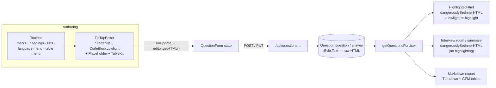
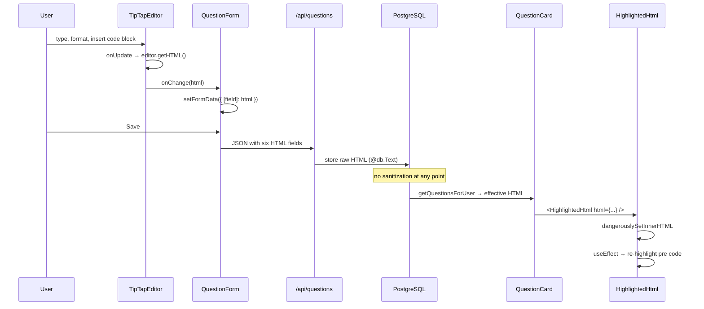

# Rich Text Editor — Design (as built)

## High-level architecture

Two halves of one contract: an **authoring** component (TipTap) and a **rendering** component
(`HighlightedHtml`). They must agree on the code-block highlighting default, or the same content
would look different while editing and while reading. HTML is the interchange format at every
boundary.



The **defaultLanguage contract** is the subtle coupling: `tiptap-editor.tsx` configures
`defaultLanguage: "typescript"` and `highlighted-html.tsx` declares
`const DEFAULT_LANGUAGE = "typescript"` with a comment saying it must match. Nothing enforces this
at build time.

## Main entry points

| Entry point | File |
|---|---|
| Editor | `src/components/editor/tiptap-editor.tsx` |
| Toolbar | `src/components/editor/toolbar.tsx` |
| Renderer | `src/components/ui/highlighted-html.tsx` |
| Primary consumer | `src/components/questions/question-form.tsx` (six instances) |
| Display consumer | `src/components/questions/question-card.tsx` |
| Unhighlighted consumers | `src/components/interview/interview-room.tsx`, `src/app/(main)/interview/[sessionId]/summary/page.tsx`, `src/components/interview/session-config-form.tsx` |
| Export consumer | `src/app/api/questions/export/route.ts` |

## Editor configuration

```ts
const lowlight = createLowlight(common);

const editor = useEditor({
  extensions: [
    StarterKit.configure({
      codeBlock: false,                 // replaced by CodeBlockLowlight
      link: { openOnClick: false },     // don't navigate while editing
    }),
    CodeBlockLowlight.configure({
      lowlight,
      defaultLanguage: "typescript",
      HTMLAttributes: { class: "bg-muted rounded-md p-4 font-mono text-sm" },
    }),
    Placeholder.configure({ placeholder }),
    TableKit.configure({ table: { resizable: true, renderWrapper: true } }),
  ],
  content,
  editable,
  parseOptions: { preserveWhitespace: "full" },
  immediatelyRender: false,
  onUpdate: ({ editor }) => onChange(editor.getHTML()),
});

if (!editor) return null;
```

Five configuration decisions, each with a reason recorded in the source comments:

1. **`codeBlock: false` in StarterKit.** The bundled code block has no highlighting, so it is
   disabled and `CodeBlockLowlight` takes its place.

2. **`defaultLanguage: "typescript"`.** The source comment explains it directly: without this the
   extension falls back to `highlightAuto`, which mis-detects short snippets. TypeScript is chosen
   because its grammar extends JavaScript's — plain JS highlights identically, while TS-only syntax
   (`interface`, `type`, `enum`, `implements`, `readonly`, annotations) still resolves. Blocks that
   declare an explicit `language-*` class still win.

3. **`parseOptions: { preserveWhitespace: "full" }`.** Without it, ProseMirror applies HTML's
   whitespace-collapsing rules when parsing saved content, so `"hello   world"` comes back as
   `"hello world"`. The view renders with `white-space: pre-wrap`, so the parser is configured to
   match. This is the fix behind the commits "fix whitespace issue" and "fix linebreak issue".

4. **`immediatelyRender: false`** plus a dynamic import with `ssr: false` in the consumer — TipTap
   touches the DOM, so it cannot render during SSR without a hydration mismatch.

5. **`onUpdate` emits `getHTML()`**, making HTML the canonical format rather than TipTap's JSON.

The `if (!editor) return null` guard means the component renders nothing until initialization
completes; the consumer's `loading` placeholder covers that window.

## Dynamic import in the consumer

```ts
const TipTapEditor = dynamic(
  () => import("@/components/editor/tiptap-editor").then((m) => m.TipTapEditor),
  { ssr: false, loading: () => <div className="bg-muted h-[160px] animate-pulse rounded-md" /> },
);
```

This keeps TipTap, ProseMirror, and lowlight out of the server bundle and out of the initial client
payload for pages that do not edit.

## Toolbar

A flat button row plus two dropdown menus, all driven by TipTap command chains:

```ts
editor.chain().focus().toggleBold().run()
```

Active state comes from `editor.isActive("bold")` / `editor.isActive("heading", { level: 1 })`.

### Language menu

```ts
const inCodeBlock = editor.isActive("codeBlock");
const current = (editor.getAttributes("codeBlock").language as string | null) ?? "typescript";
```

The `?? "typescript"` fallback exists for blocks saved before the language attribute was introduced.
Selecting a language runs `updateAttributes("codeBlock", { language })`. The trigger is disabled
outside a code block and shows "Language" instead of a value.

The nine offered languages are constrained by a documented rule: values **must** be names or aliases
lowlight has registered, otherwise the extension silently falls back to `highlightAuto`.

### Table menu

Eleven actions, all disabled by `!inTable` except "Insert table":

```ts
editor.chain().focus().insertTable({ rows: 3, cols: 3, withHeaderRow: true }).run()
```

Both menus use `DropdownMenuTrigger`'s `render` prop to project a custom `<button>`, which is how
this codebase's Base UI-derived dropdown accepts a custom trigger element.

## Renderer

```ts
const lowlight = createLowlight(common);
const DEFAULT_LANGUAGE = "typescript";

function languageOf(code: Element) {
  const match = /(?:^|\s)language-(\S+)/.exec(code.getAttribute("class") ?? "");
  const language = match?.[1];
  return language && lowlight.registered(language) ? language : DEFAULT_LANGUAGE;
}

export function HighlightedHtml({ html, className }: HighlightedHtmlProps) {
  const ref = useRef<HTMLDivElement>(null);

  useEffect(() => {
    if (!ref.current) return;
    for (const block of ref.current.querySelectorAll("pre code")) {
      const result = lowlight.highlight(languageOf(block), block.textContent ?? "");
      block.innerHTML = toHtml(result.children);
      block.classList.add("hljs");
    }
  }, [html]);

  return <div ref={ref} className={className} dangerouslySetInnerHTML={{ __html: html }} />;
}
```

The flow is: React inserts the raw HTML, then an effect walks the DOM and **replaces** each code
block's inner markup with lowlight's tokenized output, converted from a hast tree by
`hast-util-to-html`.

`lowlight.registered(language)` guards against an unregistered language class silently falling
through to auto-detection.

This is deliberate DOM mutation outside React's tree. It works because the effect re-runs on every
`html` change, restoring highlighting after any re-render that resets the innerHTML.

## Data flow



## Six editors on one form

`QuestionForm` maps a language key to a field name and renders two editors per tab:

```ts
function getFieldKey(langKey: string, field: "question" | "answer") {
  if (langKey === "en") return field;                 // question   | answer
  if (langKey === "vn") return `${field}Vn` as const; // questionVn | answerVn
  return `${field}Cus` as const;                      // questionCus| answerCus
}
```

`LanguageTabs` renders a `TabsContent` for each of the three languages, and the render-prop child
produces both editors. All three `TabsContent` bodies are mounted simultaneously — the hidden ones
are not unmounted — so **six TipTap instances exist at once**.

## Content format and consumers

| Consumer | Rendering | Highlighting | Sanitization |
|---|---|---|---|
| `QuestionCard` question + answer | `HighlightedHtml` | ✅ | ❌ |
| Interview room prompt | `dangerouslySetInnerHTML` | ❌ | ❌ |
| Interview conversation log | `dangerouslySetInnerHTML` | ❌ | ❌ |
| Interview summary prompts | `dangerouslySetInnerHTML` | ❌ | ❌ |
| Interview picked-question list | `dangerouslySetInnerHTML` | ❌ | ❌ |
| Related-question preview | DOM-based `stripHtml` | n/a | text only |
| Related-question card list | regex `stripHtml` | n/a | text only |
| TTS prompt | DOM-based `stripHtml` | n/a | text only |
| Markdown export | Turndown | n/a (fenced blocks) | n/a |

The two `stripHtml` implementations differ:

```ts
// question-card.tsx — regex; mishandles attribute values containing ">"
function stripHtml(html: string) { return html.replace(/<[^>]*>/g, "").trim(); }

// related-question-selector.tsx, interview-room.tsx — DOM-based
function stripHtml(html: string): string {
  if (typeof window === "undefined") return html;
  const tmp = document.createElement("div");
  tmp.innerHTML = html;
  return (tmp.textContent || tmp.innerText || "").trim();
}
```

## Styling

Content areas use Tailwind's typography plugin with dark-mode variants:

```
prose prose-sm dark:prose-invert max-w-none
```

The editor adds arbitrary-variant selectors to style ProseMirror internals from the outside — the
minimum height, the removed focus outline, and the placeholder pseudo-element:

```
[&_.tiptap]:min-h-[120px] [&_.tiptap]:outline-none
[&_.tiptap_p.is-editor-empty:first-child::before]:content-[attr(data-placeholder)] …
```

## State management

| State | Mechanism |
|---|---|
| Document | ProseMirror state inside the TipTap instance |
| Form values | `QuestionForm`'s single `useState` object, updated per keystroke |
| Highlighting | Imperative DOM mutation in a `useEffect` |
| Toolbar active states | Derived from `editor.isActive(...)` on each render |

The editor is **uncontrolled after mount**: `content` seeds `useEditor` once, and later changes to
that prop do not re-seed the document. This is fine in the current form, which is mounted with its
initial values and never programmatically reset.

## Error handling

| Condition | Behavior |
|---|---|
| Editor not yet initialized | `return null`; consumer's loading placeholder shows |
| Unregistered language class | Falls back to TypeScript via `lowlight.registered()` |
| Missing language attribute | Falls back to TypeScript |
| Highlighting throws | Uncaught — surfaces as a React error |
| Malformed stored HTML | Browser parses it leniently; no validation |

There is no error boundary around either component.

## Dependencies

| Package | Role |
|---|---|
| `@tiptap/react`, `@tiptap/pm` | Editor core |
| `@tiptap/starter-kit` | Base extensions (paragraph, marks, lists, headings, history, link, underline) |
| `@tiptap/extension-code-block-lowlight` | Highlighted code blocks |
| `@tiptap/extension-placeholder` | Empty-state placeholder |
| `@tiptap/extension-table` | `TableKit` |
| `lowlight` | Syntax highlighting (used in both halves) |
| `hast-util-to-html` | Converts lowlight's hast output to an HTML string |
| `turndown`, `turndown-plugin-gfm` | HTML → Markdown at export time |

`@tiptap/extension-underline` and `@tiptap/extension-link` are declared in `package.json` but **not
imported** by the editor — both capabilities come from StarterKit.

## Dependencies on other features

| Feature | Coupling |
|---|---|
| [Questions management](../questions-management/) | Six editor instances on the form; the renderer on every card; the `"<p></p>"` empty check; Turndown export |
| [Question overrides](../question-overrides/) | The override form reuses the same six editors |
| [Mock interview](../mock-interview/) | Renders prompt HTML without highlighting; strips HTML for TTS |
| [Profile sharing](../profile-sharing/) | Renders one user's authored HTML in another user's browser |

## Implementation decisions worth noting

1. **HTML as the storage format**, not TipTap JSON or Markdown. Renders directly, converts to
   Markdown on demand, and keeps the database readable — at the cost of making sanitization the
   consumer's problem.
2. **A fixed default code language instead of auto-detection**, because `highlightAuto` mis-detects
   short snippets. TypeScript is picked as a JavaScript superset.
3. **The same default in both halves**, so editing and reading agree. Enforced only by a comment.
4. **Whitespace preserved on parse** to match `pre-wrap` rendering.
5. **Re-highlighting at read time** rather than storing highlighted markup, which keeps the stored
   content clean and lets the highlighter be upgraded without a data migration.
6. **Dynamic import with `ssr: false`** to keep a large dependency out of the server bundle.
7. **Toolbar limited to what interview answers need** — no colors, alignment, or font controls.

---

## Observed Technical Debt

1. **No HTML sanitization anywhere.** Stored HTML is injected with `dangerouslySetInnerHTML` in five
   places, and content crosses user boundaries in two of them: admin defaults render for every user
   in the domain, and shared profiles render one user's content in another's browser. The mock
   interview additionally injects **LLM-generated** follow-up text the same way. No sanitizer
   (`dompurify`, `sanitize-html`, or similar) is installed. This is the single most significant issue
   in the codebase.
2. **The `defaultLanguage` contract is enforced only by a comment.** Two files independently declare
   `"typescript"`; nothing shares or asserts the constant.
3. **`lowlight` is instantiated twice** — `createLowlight(common)` in the editor and again in the
   renderer — duplicating the full common language registry.
4. **Six TipTap instances mount simultaneously** on the question form, including the four in hidden
   language tabs.
5. **Highlighting is imperative DOM mutation** outside React's tree, coupled to the internal
   structure of the stored HTML (`pre code`).
6. **Two divergent `stripHtml` implementations**, one of which (the regex) is incorrect for attribute
   values containing `>`.
7. **The interview surfaces do not use `HighlightedHtml`**, so code blocks are unhighlighted there
   while being highlighted on question cards.
8. **`@tiptap/extension-underline` and `@tiptap/extension-link` are unused dependencies** — their
   functionality comes from StarterKit.
9. **Links have no toolbar affordance**, so the underlying extension is only reachable by pasting.
10. **The `editable` prop is dead** — no caller ever passes it.
11. **No content length limit** at any layer, against `@db.Text` columns.
12. **Client and server disagree on emptiness** — the form rejects `"<p></p>"` while the API accepts
    it. See [`../questions-management/`](../questions-management/) Q-V3.
13. **No error boundary** around either component; a highlighting exception takes down the surrounding
    tree.
14. **The editor is uncontrolled after mount**, which is correct today but is an unstated constraint
    that any future "reset form" or "load draft" feature would violate silently.
15. **Table cells wrap content in `<p>`**, which forced a custom Turndown rule in the export path — a
    coupling between the editor's output shape and the export implementation.
</content>
