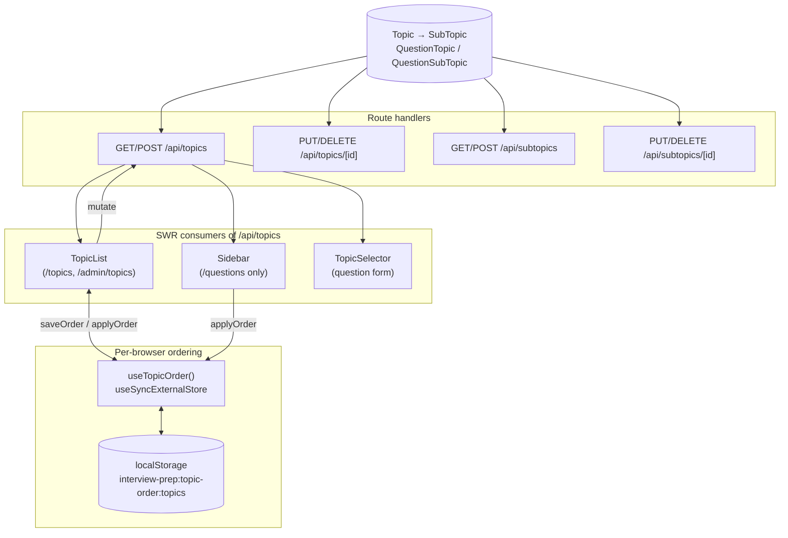
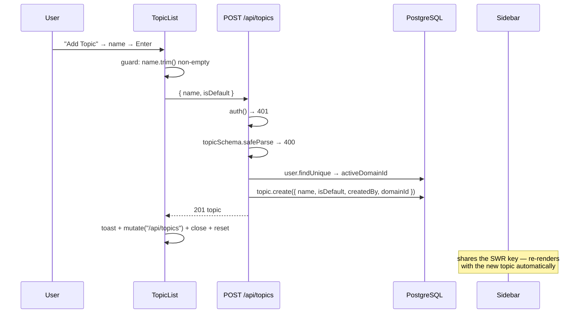

# Topics & Sub-Topics — Design (as built)

## High-level architecture

Two-level taxonomy stored in PostgreSQL, read through SWR by three client components, and mutated
through four REST handlers. Layered on top is a **presentation-only ordering system** that lives
entirely in `localStorage` and never reaches the server.



The ordering store is the structurally interesting part: it uses `useSyncExternalStore` so that the
topics page and the sidebar stay in lockstep without any shared React state or context.

## Main entry points

| Entry point | File |
|---|---|
| Topics page | `src/app/(main)/topics/page.tsx` |
| Admin topics page | `src/app/(main)/admin/topics/page.tsx` |
| Topic CRUD UI | `src/components/topics/topic-list.tsx` |
| Sidebar | `src/components/layout/sidebar.tsx` |
| Sidebar visibility | `src/components/layout/conditional-sidebar.tsx` |
| Form pickers | `src/components/topics/topic-selector.tsx` |
| Icons | `src/components/layout/topic-icon.tsx` |
| Ordering store | `src/lib/topic-order.ts` |
| Topic collection API | `src/app/api/topics/route.ts` |
| Topic item API | `src/app/api/topics/[id]/route.ts` |
| Sub-topic collection API | `src/app/api/subtopics/route.ts` |
| Sub-topic item API | `src/app/api/subtopics/[id]/route.ts` |
| Schemas | `src/lib/validations/topic.ts` |

## Data model

```prisma
model Topic {
  id        String   @id @default(cuid())
  name      String
  isDefault Boolean  @default(false)
  createdBy String?                       // null for defaults
  domainId  String?

  creator   User?      @relation(fields: [createdBy], references: [id], onDelete: SetNull)
  domain    Domain?    @relation(fields: [domainId],  references: [id], onDelete: SetNull)
  subTopics SubTopic[]
  questions QuestionTopic[]

  @@unique([name, createdBy, domainId])
}

model SubTopic {
  id        String   @id @default(cuid())
  name      String
  topicId   String
  isDefault Boolean  @default(false)
  createdBy String?

  topic     Topic    @relation(fields: [topicId], references: [id], onDelete: Cascade)
  creator   User?    @relation(fields: [createdBy], references: [id], onDelete: SetNull)
  questions QuestionSubTopic[]

  @@unique([name, topicId, createdBy])
}
```

Two things follow from the shape:

- **`SubTopic` has no `domainId`.** Its domain is whatever its parent topic's is. This keeps the
  columns in sync automatically but makes `PUT /api/subtopics/[id]` a domain-moving operation.
- **The unique keys include `createdBy`**, which is `null` for defaults. In PostgreSQL, `NULL` values
  are distinct in a unique index, so *multiple* default topics with the same name and domain would
  not actually collide — the constraint only bites for a single user creating a duplicate.

`QuestionTopic` and `QuestionSubTopic` are join tables with composite primary keys and `Cascade` on
both sides.

## API surface

### `GET /api/topics`

```ts
const user = await prisma.user.findUnique({
  where: { id: session.user.id }, select: { activeDomainId: true },
});

const topics = await prisma.topic.findMany({
  where: {
    domainId: user?.activeDomainId,
    OR: [{ isDefault: true }, { createdBy: session.user.id }],
  },
  include: {
    subTopics: {
      where: { OR: [{ isDefault: true }, { createdBy: session.user.id }] },
      orderBy: { name: "asc" },
    },
  },
  orderBy: { name: "asc" },
});
```

Note `domainId: user?.activeDomainId` written directly rather than spread conditionally — when the
value is `null` this becomes `domainId IS NULL`, which is why a domain-less user sees nothing
(T-X2). The questions layer uses the opposite idiom for the same concept.

### `POST /api/topics` and `POST /api/subtopics`

Both share the same default-flag logic:

```ts
const isAdmin = session.user.role === "ADMIN";
data: {
  name: parsed.data.name,
  isDefault: isAdmin && body.isDefault === true,
  createdBy: isAdmin && body.isDefault === true ? null : session.user.id,
  domainId: user?.activeDomainId,        // topics only
}
```

`body.isDefault` is read from the **raw** request body, not from `parsed.data`, because `isDefault`
is absent from both Zod schemas. The `=== true` comparison makes this safe in practice, but it does
mean the flag is entirely unvalidated.

The ternary encodes the rule "a default topic is ownerless": `createdBy` is `null` exactly when
`isDefault` is `true`.

### `GET /api/subtopics`

```ts
where: {
  ...(topicId
    ? { topicId }                                        // no domain filter
    : { topic: { domainId: user?.activeDomainId } }),    // domain filter via the parent
  OR: [{ isDefault: true }, { createdBy: session.user.id }],
}
```

The branch is the source of T-X3: supplying a `topicId` bypasses domain scoping entirely.

Note that **no component currently calls this endpoint** — `TopicSelector` derives sub-topics from
the nested `subTopics` returned by `/api/topics`. The route exists but is unused by the UI.

### Item routes

`PUT` and `DELETE` on both resources use the identical permission predicate seen throughout the
codebase:

```ts
const canEdit =
  topic.createdBy === session.user.id ||
  (topic.isDefault && session.user.role === "ADMIN");
```

`PUT /api/topics/[id]` writes `{ name }` only. `PUT /api/subtopics/[id]` writes
`{ name, topicId }` — `topicId` is required by `subTopicSchema`, so the client must always send it,
and the UI always sends the current parent.

## The ordering store — `src/lib/topic-order.ts`

A small external store built on `useSyncExternalStore`, chosen so that two unrelated component trees
(the topics page and the sidebar) stay synchronized without a shared provider.

```ts
export interface TopicOrderState {
  topics: string[];                        // ordered topic ids
  subs: Record<string, string[]>;          // ordered sub-topic ids, keyed by parent topic id
}

const KEY_PREFIX   = "interview-prep:topic-order";
const CHANGE_EVENT = "interview-prep:topic-order-change";
export const TOPIC_ORDER_KEY = "topics";   // the single key used everywhere
```

Three mechanisms make it work:

**1. A custom event for same-tab notification.** The native `storage` event fires only in *other*
tabs, so `saveOrder` dispatches its own event:

```ts
window.localStorage.setItem(storageKey(key), JSON.stringify(state));
window.dispatchEvent(new CustomEvent(CHANGE_EVENT, { detail: { key } }));
```

`subscribe` listens to both:

```ts
window.addEventListener(CHANGE_EVENT, onChange);   // this tab
window.addEventListener("storage", onChange);      // other tabs
```

**2. A snapshot cache for referential stability.** `useSyncExternalStore` requires `getSnapshot` to
return the same reference when nothing changed, or React re-renders forever. Since parsing JSON
produces a new object each call, results are memoized against the raw string:

```ts
const snapshotCache = new Map<string, { raw: string | null; value: TopicOrderState }>();

function getSnapshot(key: string): TopicOrderState {
  const raw = typeof window === "undefined" ? null : localStorage.getItem(storageKey(key));
  const cached = snapshotCache.get(key);
  if (cached && cached.raw === raw) return cached.value;   // stable reference
  const value = parse(raw);
  snapshotCache.set(key, { raw, value });
  return value;
}
```

The third argument to `useSyncExternalStore` is a server snapshot returning the frozen `EMPTY`
constant, which keeps SSR consistent.

**3. A stable sort for unknown items.**

```ts
export function applyOrder<T extends { id: string }>(items: T[], order: string[]): T[] {
  if (!order.length) return items;
  const index = new Map(order.map((id, i) => [id, i] as const));
  return [...items].sort((a, b) => (index.get(a.id) ?? Infinity) - (index.get(b.id) ?? Infinity));
}
```

Items absent from the saved order get `Infinity` and, because `Array.prototype.sort` is stable, keep
their server-provided relative order at the end of the list. That is what makes a newly created topic
appear predictably without invalidating the whole saved order.

All writes are wrapped in `try/catch` and failures are swallowed — ordering is explicitly
best-effort. `parse` likewise falls back to `EMPTY` on malformed JSON.

## Drag and drop

`@dnd-kit` with two nested `DndContext`s:

- The outer context in `TopicList` handles topic reordering with `verticalListSortingStrategy`.
- Each `SortableTopicCard` creates its **own** inner context for its sub-topic badges, using
  `rectSortingStrategy` because badges wrap in a flex row.

Both use the same sensor configuration:

```ts
useSensor(PointerSensor, { activationConstraint: { distance: 5 } }),
useSensor(KeyboardSensor, { coordinateGetter: sortableKeyboardCoordinates })
```

The 5-pixel activation distance is what allows the grip handle to also receive clicks, and the
keyboard sensor provides accessible reordering. Drag handles are dedicated `<button>` elements with
`aria-label={`Reorder ${name}`}` rather than making the whole card draggable.

On drop, the handler computes the new array with `arrayMove` and persists ids only:

```ts
const reordered = arrayMove(orderedTopics, oldIndex, newIndex);
persistOrder({ ...order, topics: reordered.map((t) => t.id) });
```

Sub-topic order is stored per parent: `{ ...order.subs, [topicId]: sub.map((s) => s.id) }`.

## Component behavior

### `TopicList`
One component serving both `/topics` and `/admin/topics`, differing only by the `isAdmin` prop.
Holds seven pieces of local state (two dialog flags, the editing topic, the parent topic id, the
editing sub-topic, the name field, and the `isDefault` checkbox) and reuses a **single `name`
state** for both the topic and sub-topic dialogs.

Mutations follow a uniform shape: `fetch` → on success `toast` + `mutate()` + close dialog + reset
state; on failure `await res.json()` and toast `data.error`.

### `Sidebar`
Reads the same SWR key, applies the same ordering, and renders a two-level tree. Expansion state is
a `Set<string>` initialized **once** from the URL:

```ts
const [expanded, setExpanded] = useState<Set<string>>(() => {
  const initial = new Set<string>();
  if (activeTopicId) initial.add(activeTopicId);
  return initial;
});
```

Because this is a lazy initializer with no synchronizing effect, later `topicId` changes do not
auto-expand (T-X12).

Wrapped in `<Suspense>` because it calls `useSearchParams()`.

### `ConditionalSidebar`
Gates rendering by pathname:

```ts
function showSidebarFor(pathname: string): boolean {
  return pathname === "/questions" || pathname.startsWith("/questions/");
}
```

Exports both the desktop aside and a `ConditionalSidebarMobileTrigger` wrapper used by the header, so
the hamburger button disappears on pages without a sidebar.

### `TopicSelector`
Generic over `type: "topic" | "subtopic"`, backed by a `Popover` + `cmdk` `Command`. Maintains two
derived lists:

```ts
const items = type === "topic"
  ? topics?.map(...)
  : topics?.filter((t) => !topicIds || topicIds.includes(t.id))
           .flatMap((t) => t.subTopics.map(...));

// unfiltered — used only to resolve names for already-selected badges
const allItems = type === "topic" ? items : topics?.flatMap((t) => t.subTopics.map(...));
```

The `allItems` list exists specifically so a selected sub-topic still renders its name after its
parent topic is deselected. The selection itself is not pruned, which is T-X14.

## Data flow — create a topic



`mutate()` on the shared `/api/topics` key is what keeps the sidebar in sync with the topics page
without any explicit coordination.

## State management

| State | Mechanism | Persisted |
|---|---|---|
| Topic/sub-topic data | SWR on `/api/topics`, shared by three components | Server |
| Dialog and form state | Local `useState` in `TopicList` | No |
| Expansion state | Local `useState<Set>` in `Sidebar` | No |
| Personal ordering | `localStorage` + `useSyncExternalStore` | Per browser |
| Active topic filter | URL query string on `/questions` | Shareable |
| Question↔topic links | Join tables, written by the question API | Server |

## Error handling

| Layer | Behavior |
|---|---|
| API auth / not found / permission / validation | `401` / `404` / `403` / `400` with a JSON `error` |
| Unique-constraint violation | **Uncaught** — Prisma `P2002` escapes as a `500` |
| Save failure (client) | `toast.error(data.error \|\| "Failed to save topic")` |
| Delete failure (client) | `toast.error("Failed to delete")` |
| `localStorage` write failure | Swallowed silently in `saveOrder` |
| Corrupt `localStorage` JSON | Caught in `parse`, treated as `EMPTY` |
| SWR fetch failure | `error` is never destructured; the list simply stays empty |

## Authorization

Identical to questions: creator, or admin on a default. `isDefault` is admin-gated at both create
sites. Notably absent:

- No check that `POST /api/subtopics`'s `topicId` is visible to the caller (T-V4, T-X17).
- No check that `PUT /api/subtopics/[id]`'s new `topicId` is visible or in the same domain (T-X4).

## Dependencies on other features

| Feature | Coupling |
|---|---|
| [Domains](../domains/) | Topics carry `domainId`; sub-topics inherit it; the null-domain idiom differs from the questions layer |
| [Questions management](../questions-management/) | Join tables, the `topicId`/`subTopicId` filters, the form pickers, and the topic pre-fill on create |
| [Authentication](../authentication/) | `session.user.id` and `.role` drive visibility and the default flag |
| [Mock interview](../mock-interview/) | Session config filters questions by `topicIds` / `subTopicIds` |

## Implementation decisions worth noting

1. **Ordering in `localStorage`, not the database.** Deliberate, and documented in the module header:
   it is a personal presentation preference, so no schema change or API was needed. The cost is that
   it does not follow the user across devices.
2. **`useSyncExternalStore` over context.** Lets two disconnected trees subscribe to the same store
   without threading a provider through the layout, and gets tab-to-tab sync almost for free.
3. **A single shared ordering key** so the topics page and the sidebar cannot drift apart.
4. **Stable sort with `Infinity` for unknown ids**, so a new topic does not require rewriting the
   saved order and never disappears.
5. **One `TopicList` for both the user and admin pages**, parameterized by `isAdmin`.
6. **Sub-topics nested inside the `/api/topics` response** rather than fetched separately, which is
   why `/api/subtopics` ended up unused by the UI.
7. **Sidebar restricted to `/questions`** via `ConditionalSidebar`, since topic navigation is only
   meaningful there.
8. **5px drag activation distance** so grip handles remain clickable and taps do not start drags.

---

## Observed Technical Debt

1. **Duplicate names produce a `500`, not a `409`.** Neither `POST` handler catches Prisma's `P2002`.
   The client then calls `res.json()` on a non-JSON error response, so the user may get no toast at
   all. This is the most likely error a real user will hit.
2. **`isDefault` bypasses validation** in both `POST` handlers — read from the raw `body` rather than
   `parsed.data`, and absent from both Zod schemas.
3. **The null-domain idiom is inconsistent with the questions layer.** `{ domainId: activeDomainId }`
   here means "only null-domain rows"; `...(domainId ? { domainId } : {})` there means "no filter".
   See [`../domains/design.md`](../domains/design.md).
4. **`GET /api/subtopics?topicId=` drops domain scoping** (T-X3), and the endpoint is dead code —
   no component calls it.
5. **`POST /api/subtopics` does not validate the parent topic** — it accepts any `topicId`, including
   one the caller cannot see or one that does not exist (which then fails as an unhandled FK error).
6. **`PUT /api/subtopics/[id]` can silently move a sub-topic across domains** with no check.
7. **`isDefault` cannot be changed after creation** (T-X6), and the edit dialog misleadingly renders
   an unchecked checkbox that is ignored on submit (T-X7).
8. **The ordering key is not scoped by user or domain** (T-X10). Two accounts in the same browser,
   or two domains for one account, share one order record.
9. **Stale sub-order entries** are left behind when a sub-topic moves between topics (T-X11).
10. **Sidebar expansion does not resync with the URL** (T-X12) because the state is only initialized
    lazily, with no effect watching `activeTopicId`.
11. **Deselecting a topic does not prune its selected sub-topics** from the question form (T-X14), so
    a question can be saved with a sub-topic whose parent topic is not attached.
12. **The permission predicate is copy-pasted four times** across the two item routes.
13. **The active-domain lookup is copy-pasted three times** within this feature alone.
14. **`TopicList` shares one `name` state between two dialogs**, relying on careful resetting in five
    different handlers to avoid leaking a value from one dialog into the other.
15. **Topic icons are an exact-name map** (T-X13), so every user-created topic gets the generic
    fallback and the map must be edited in code to support a new one.
16. **No question counts and no usage check before deletion** (T-X15) — a user deleting a topic cannot
    see how many questions it touches, and the confirm text does not mention questions at all.
17. **`/admin/topics` is functionally identical to `/topics` for an admin** (T-X16); it exists only to
    provide a different heading.
18. **Names are not trimmed** before storage or the uniqueness check, so `"React"` and `"React "` are
    distinct topics.
19. **SWR `error` is never read** in any of the three consumers, so a failed topic fetch renders as an
    empty taxonomy rather than an error state.
</content>
